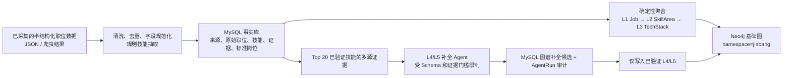
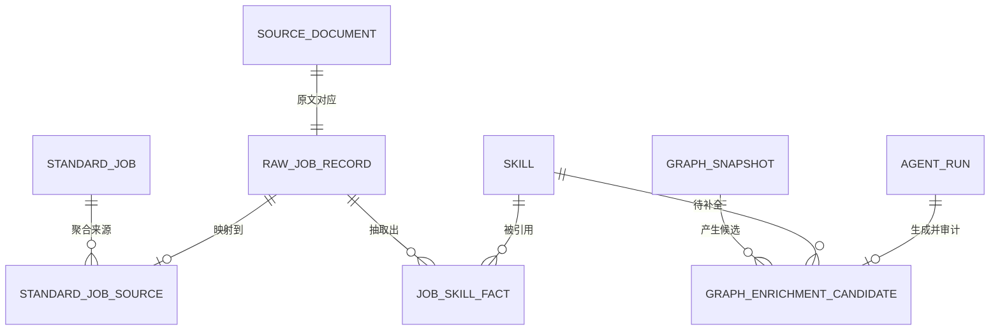

# 知识图谱数据链路说明：从半结构化职位数据到 L1-L5 能力图谱

> 适用范围：智联职引（JieBang）当前 FYZ 后端实现。本文说明数据如何从已采集的半结构化职位数据出发，经 MySQL 事实库沉淀，构建 Neo4j 中可稳定复现的 L1-L3 图谱，并由 Agent 在严格证据约束下补全 L4-L5。
>
> 核心原则：**MySQL 是唯一事实源，Neo4j 是可重建的查询读模型；Agent 只能补充候选的深层语义，不能改写已验证的基础事实。**

## 1. 为什么需要分层、分库

招聘数据天然是半结构化的：职位名称、公司、城市、薪资、岗位描述（JD）、职责和任职要求虽然有字段，但字段内容大多是自然语言；同一个岗位也可能使用不同写法。若直接把原始 JD 写入图数据库，会同时带来重复、口径不一致、LLM 幻觉难以回溯等问题。

当前方案把职责分开：

| 层次 | 存储/组件 | 负责什么 | 是否可重建 |
| --- | --- | --- | --- |
| 原始与事实层 | MySQL | 保存来源、原始 JD、标准技能、抽取证据、标准岗位、任务和审计记录 | 否，是权威数据 |
| 基础图层（L1-L3） | Neo4j | 根据 MySQL 中已验证事实生成岗位—领域—技能结构 | 是，可全量重建 |
| 深层图层（L4-L5） | Agent + MySQL 候选记录 + Neo4j | 在已有技能下生成有证据支撑的技术细节与知识点 | 是，随图快照重建 |

整体数据流如下：



## 2. 起点：半结构化职位数据

### 2.1 数据的典型形态

项目中的职位来源数据以 JSON/爬虫结果形式进入。每条记录至少围绕以下信息组织：

- 来源标识与链接：`source`、`url`、`external_id`；
- 职位基本信息：`title`、`company`、城市、薪资、经验和学历；
- 主要自然语言内容：`jd_text`、`responsibilities`、`requirements`、`keywords`；
- 时间信息：`posted_at`、`crawled_at`。

这些数据“有字段但不统一”：例如“Python 后端工程师”“Python开发（高级）”“急聘 Python 服务端”可能指向相近能力方向，但不能仅靠字符串完全相等来判断。

### 2.2 清洗、去重与可追溯来源

进入事实库前，系统以规则优先方式做基础治理：空白和格式统一、职位标题标准化、技能别名归一、内容指纹去重。内容指纹由 `source | url | title | company | posted_at | jd_text` 规范化后计算 SHA-256 得到，因此相同来源的相同职位可重复导入而不重复落库。

这一步不追求把自然语言“理解完”，而是先保证两件事：

1. 原始文本和来源地址可回看，后续任何技能或图节点都能追溯；
2. 重复执行导入不会持续制造重复记录，为后续全量重建提供稳定输入。

## 3. MySQL：事实库、证据库和审计库

MySQL 不仅是导入的中转站，而是整个图谱的数据权威。主要数据对象及其关系如下。



| MySQL 表/实体 | 保存内容 | 在图谱中的作用 |
| --- | --- | --- |
| `source_document` | 来源、URL、标题、公司、原文摘要、内容指纹 | 保存可追溯证据；可在 Neo4j 中作为辅助 `SourceDocument` 节点 |
| `raw_job_record` | 原始职位字段及 JD、职责、要求 | 半结构化数据的落库形态；可回溯每个事实来自哪条 JD |
| `skill` | 标准技能名、别名、分类、规范键 | L3 技术栈节点的稳定主数据 |
| `job_skill_fact` | 职位—技能事实、重要性、置信度、证据文本、验证状态、抽取方式 | L1-L3 构图只读取 `verification_status=verified` 的事实 |
| `standard_job`、`standard_job_source` | 标准岗位与原始/内部岗位的映射、别名、岗位层级 | 将不同写法的职位聚合为稳定的 L1 岗位 |
| `graph_snapshot`、`graph_sync_batch` | 图谱版本、同步模式、状态、节点/边/事实数 | 记录每一次图谱生成是否成功及其规模 |
| `graph_enrichment_candidate` | L4/L5 候选、证据来源 ID、置信度、验证状态 | 将 Agent 输出先持久化、后筛选，而不是直接信任并入图 |
| `agent_run` | 模型、提示词版本、输入摘要、结构化输出、耗时与异常 | 为 Agent 输出提供可审计、可回放的运行记录 |

### 3.1 技能事实如何形成

当前默认抽取器是规则优先的 `RuleSkillExtractor`：它用仓库内技能词典和别名表扫描 `jd_text`、职责、要求三个文本区段，识别标准技能，保留命中的上下文作为 `evidence_text`，并根据“优先、加分、bonus”等标记区分必需技能与加分技能。

每个 `job_skill_fact` 都携带：技能、出现频次、重要性、置信度、证据文本、抽取方法和验证状态。这样 L1-L3 的每条边不是“模型说相关”，而是“有哪几条职位事实支持、证据来自何处、置信度多少”。

### 3.2 岗位标准化

对 `raw_job_record.title`，系统先剥离“急聘”“高薪”“校招”、城市尾缀、括号补充和年限等招聘噪声，再统一常见技术词写法，保留专业方向；随后生成 `canonical_key`，聚合到 `standard_job`。

例如，“急聘 Python 后端工程师（高级）-杭州”和“Python后端工程师”会被归入同一标准岗位，同时原始标题以别名和 `standard_job_source` 关系保留。岗位层级（junior/middle/senior）和技术方向（ai/data/devops/backend）也由确定性规则推断，供图谱筛选和展示使用。

## 4. Neo4j 的三层固定基础图（L1-L3）

“固定”不是指永远不变，而是指其生成逻辑不依赖 LLM、只来自 MySQL 中已验证且可审计的事实；同一份 MySQL 数据重复同步应得到同一语义结构。

| 层级 | Neo4j 标签 | 数据来源 | 代表属性 |
| --- | --- | --- | --- |
| L1 | `Job` | `standard_job` | `name`、`canonicalKey`、别名、方向、级别、来源数 |
| L2 | `SkillArea` | `skill.category` 聚合 | 名称、方向、层级说明 |
| L3 | `TechStack` | `skill` | 标准技能名、规范键、分类、频次 |

基础关系为：

```text
(Job)-[:REQUIRES_AREA]->(SkillArea)-[:CONTAINS]->(TechStack)
```

关系也携带事实聚合字段：`frequency`、`sourceCount`、`confidence`、`importance`、`firstSeenAt`、`lastSeenAt`、`sourceIds`。其中：

- `REQUIRES_AREA`：某标准岗位在一个技能领域上的需求强度；
- `CONTAINS`：某技能领域包含的标准技能；同时记录与哪些岗位有关；
- 辅助的 `SUPPORTS` 关系可将来源文档连接到岗位/技能，支持从可视化结果回溯原始 JD。

### 4.1 聚合过程

`GraphService.sync()` 的关键步骤是：

1. 对 `raw_job_record` 和内部 `job_posting` 聚合标准岗位；
2. 只读取验证状态为 `verified` 的 `job_skill_fact`；
3. 根据事实中的岗位、技能分类、技能 ID，汇总岗位—领域和领域—技能关系；
4. 汇总频次、最大置信度/重要性、最早和最近观测时间、来源文档集合；
5. 将结果写入 Neo4j。

因此，L1-L3 中没有“凭空生成”的上游节点。没有通过验证的技能事实不会被构图；软技能目前也不会进入 L4/L5 的候选补全范围。

### 4.2 幂等同步与命名空间隔离

所有项目节点与关系都带有 `namespace=jiebang`，并以 `(namespace, id)` 建立唯一约束。写入使用 Cypher `MERGE`：同一节点或关系再次同步时更新属性和 `syncVersion`，不会重复创建。

- `incremental`：合并本次生成的节点与关系，不删除已有图数据；
- `full`：合并完成后执行 `cleanup_stale(version)`，只删除 `namespace=jiebang` 内未被本次 `syncVersion` 覆盖的节点和关系。

这保证了项目可以安全地重建自己的读模型，不会误删 Neo4j 实例中其他命名空间的数据。

## 5. L4/L5：Agent 如何做“详细描述补充”

### 5.1 两层分别表达什么

| 层级 | 标签 | 例子 | 作用 |
| --- | --- | --- | --- |
| L4 | `TechPoint` | “索引设计与优化”“RESTful API 设计” | 将 L3 的宽泛技能细化到可实践的技术点 |
| L5 | `KnowledgePoint` | “联合索引最左前缀原则”“接口幂等性设计” | 说明需要掌握的知识、难度和面试考察点 |

深层关系为：

```text
(TechStack)-[:REFINES_TO]->(TechPoint)-[:HAS_KNOWLEDGE]->(KnowledgePoint)
```

### 5.2 不是“对所有技能随意扩写”

图谱同步可选择 `enrich_top_skills`。开启时，系统只从非软技能、且具有已验证 `job_skill_fact` 的技能中按覆盖度选择前 20 个；每个技能最多收集 8 条证据。只有同时满足以下条件，才调用 DeepSeek 补全：

1. 模型提供方已启用；
2. 至少有 2 个来源文档；
3. 这些文档来自至少 2 个独立平台来源。

默认数据库迁移脚本 `03_rebuild_neo4j.py` 调用 `GraphService.sync(mode="full", enrich_top_skills=False)`。也就是说，团队导入 MySQL 快照后的常规 Neo4j 重建不调用模型，保证离线、可复现且不产生额外模型成本；需要深层补全时，再通过图谱同步 API 显式开启。

### 5.3 Agent 的输入、输出与硬约束

Agent 的输入包含：已验证 L3 技能名、技能领域、关联岗位方向，以及带 `source_id`、来源平台、证据文本的多条 JD 片段。输出被限制为结构化 JSON：

```json
{
  "skill_name": "MySQL",
  "job_directions": ["后端开发工程师"],
  "skill_area": "Database",
  "tech_points": [
    {
      "name": "索引设计与优化",
      "detail": "基于招聘要求归纳的索引设计能力说明",
      "confidence": 0.86,
      "source_ids": [101, 205],
      "knowledge_points": [
        {
          "name": "联合索引最左前缀原则",
          "description": "理解联合索引的匹配顺序及其对查询计划的影响",
          "difficulty": "medium",
          "confidence": 0.82,
          "source_ids": [101, 205],
          "prerequisites": []
        }
      ]
    }
  ]
}
```

系统提示词明确限制 Agent：只能在既有 Job—SkillArea—TechStack 路径下补充 L4/L5；不得生成新的岗位、领域或技术栈；不得引用输入中不存在的来源；不得推测。`source_ids` 不是装饰字段，而是后验筛选的依据。

### 5.4 后验验证：模型输出不等于入图

Agent 返回后，系统先将结果写入 `graph_enrichment_candidate` 和 `agent_run`。随后执行以下门槛：

- 每个 L4 技术点置信度必须 `>= 0.75`；
- 每个 L5 知识点置信度必须 `>= 0.75`；
- 每个节点至少引用 2 个不同 `source_id`；
- 这些来源必须属于至少 2 个不同平台；
- 引用 ID 必须在本次输入证据集合内。

未通过的技术点或知识点会被过滤，不会写入 Neo4j。候选整体只有在保留至少一个 L4 技术点时才标记为 `verified`。随后构图阶段只读取 `verification_status=verified` 的候选，并为节点写入置信度和来源数。

这形成了“**先候选、后验证、再入图**”的闭环，避免 LLM 把通用常识或不受岗位数据支持的内容直接变成图谱事实。

## 6. 从 MySQL 重建 Neo4j 的操作流程

团队共享数据的当前入口在 `fyz-src/backend/scripts/`。在 `fyz-src/backend` 目录执行：

```powershell
conda activate jiebang
python scripts/01_prepare_mysql_schema.py
python scripts/02_import_mysql_snapshot.py --replace
python scripts/03_rebuild_neo4j.py
python scripts/04_verify_database_import.py
```

或使用封装命令：

```powershell
python scripts/run_database_import.py --replace
```

四步的意义是：

1. 使用 Alembic 创建/升级 MySQL 表结构；
2. 校验快照哈希和 Alembic 版本后，替换导入全部 MySQL 业务表，并核对各表行数；
3. 从 MySQL 已验证事实执行一次 `full` 同步，只重建 Neo4j 的 `jiebang` 命名空间；
4. 校验 MySQL 表计数、快照版本、最新图谱快照以及 Neo4j 节点/关系计数。

当前快照相关代码要求数据库迁移版本为 `20260712_0006 (head)`。导入前应先以 `alembic current` 确认版本一致；版本不一致时，应升级或重新导出快照，而不是绕过校验。

## 7. 查询与使用方式

图谱查询 API 均从 Neo4j 读模型读取，典型接口包括：

- `GET /api/v1/graph/panorama`：按技术方向、级别、标签或关键词查看全景；
- `GET /api/v1/graph/jobs/{job_id}/tree?depth=5`：按岗位查看完整 L1-L5 路径；
- `GET /api/v1/graph/expand`、`/search`、`/path`：做局部展开、检索和路径分析；
- `POST /api/v1/graph/sync`：创建 `full` 或 `incremental` 同步任务，并可显式决定是否补全 Top 20 深层技能；
- `GET /api/v1/graph/snapshots`：查看同步快照与规模、状态。

默认全景查询会隐藏 `SourceDocument` 和 `GraphSnapshot` 等辅助节点，避免图形被审计信息淹没；需要追溯时可单独查询或在节点详情中展开。

## 8. 一条数据的完整示例

以一条“Python 后端工程师”职位为例：

1. 爬虫/JSON 提供职位标题、来源链接、JD、职责和要求；
2. 系统算内容指纹，保存 `source_document` 与 `raw_job_record`，重复数据不会重复导入；
3. 规则抽取器从“熟悉 Flask、MySQL，负责 RESTful API 开发”等文本中抽取标准技能及原文证据，写入 `skill` 和 `job_skill_fact`；
4. 标题清洗后，多个写法聚合为 `standard_job=Python后端工程师`；
5. 同步服务仅用已验证事实，生成 `Job(Python后端工程师)` → `SkillArea(Framework/Database/Programming Language)` → `TechStack(Flask/MySQL/Python)`；每条边保留频次、来源数和时间范围；
6. 若 MySQL 是该技能的高覆盖度证据且跨至少两个平台，Agent 才可能补出“Flask 蓝图与路由组织”“MySQL 索引优化”等 L4，再补出相应 L5 知识点；
7. 只有所有置信度和多源引用校验都通过的 L4/L5，才以 `REFINES_TO`、`HAS_KNOWLEDGE` 关系加入 Neo4j；
8. 若需重建或模型输出发生变化，以 MySQL 事实与候选审计记录为依据再次 `full` 同步即可。

## 9. 关键边界与维护建议

- 不要将 Neo4j 当作唯一数据源；任何修正都应先落 MySQL，再同步图谱。
- 不要把未验证的技能事实或 LLM 原始输出直接写入 L1-L5；必须经过验证状态与证据阈值过滤。
- 图谱“全量同步”只清理 `namespace=jiebang`，不要将其改为无命名空间的全库删除。
- 普通数据库迁移不启用 L4/L5 Agent；深层补全应明确触发、记录模型版本，并关注候选与 `AgentRun` 审计结果。
- 需要新增或调整技能词典时，应先评估其对 `skill` 规范键、事实抽取和 L1-L3 稳定性的影响，再重新执行同步与验证。

## 10. 相关实现位置

| 主题 | 位置 |
| --- | --- |
| 图谱服务、聚合、补全过滤、构图 | `fyz-src/backend/app/services/graph_service.py` |
| Neo4j `MERGE`、命名空间与过期清理 | `fyz-src/backend/app/repositories/graph_repository.py` |
| 岗位标题标准化 | `fyz-src/backend/app/domain/job_standardizer.py` |
| 规则技能抽取与内容指纹 | `fyz-src/backend/app/services/skill_extractor.py` |
| MySQL 技能、来源、事实、Agent 审计模型 | `fyz-src/backend/app/models/skill.py` |
| MySQL 图谱审计与候选模型 | `fyz-src/backend/app/models/graph.py` |
| L4/L5 Agent 与输出 Schema | `agent-development/src/jiebang_agents/graph_enrichment/` |
| 导入后 Neo4j 全量重建脚本 | `fyz-src/backend/scripts/03_rebuild_neo4j.py` |
| 团队数据库迁移流程 | `fyz-src/backend/scripts/DATABASE_TRANSFER.md` |
