# FYZ 数据链路、图谱、Agent 防幻觉与 RAG 优化计划

> 文档版本：v1.1
>
> 编制日期：2026-07-30
>
> 适用范围：`fyz-src/backend`、`fyz-src/frontend`、`agent-development/src/jiebang_agents` 及其直接相关的数据迁移、测试和说明文档
>
> 当前状态：已评审；Phase 0/1、Phase 2/2.1 已完成。Phase 3 已完成 Graph Enrichment 与 Match Explanation 两条防幻觉纵向闭环，包括多类型证据引用、生成后门禁、确定性拒答/降级和审计持久化；其余 Agent 将按同一契约逐步接入。
> 前置文档：[Agent 分析和设计](./Agent分析和设计.md)、[FYZ 端 MVP 开发规划](./FYZ端MVP开发规划.md)、[知识图谱架构](../../fyz-src/docs-plans/GRAPH_ARCHITECTURE.md)

## 1. 文档目标

FYZ 管理端已完成主要前后端联通，当前优化重点由“功能是否可用”转向“数据是否可信、图谱是否可解释、Agent 是否有证据、检索是否可评测”。

本计划用于指导以下四类优化任务：

1. 治理招聘数据的时滞、噪声、重复和来源可信度问题。
2. 优化 MySQL 到 Neo4j 的图谱构建、审核、发布和展示链路。
3. 为技能抽取、图谱补全、JD 生成、匹配解释和职业规划 Agent 建立统一防幻觉门禁。
4. 建设可追溯、可重建、可评测的 RAG 检索层。

本计划不以“新增更多 Agent”为首要目标，而是先建立可靠的数据、证据、审核和评测基础。

## 2. 范围与边界

### 2.1 本轮纳入

- 多源招聘数据标准化、时间解析、质量评分和近重复检测。
- `JobSkillFact` 的验证粒度、证据链和审核状态优化。
- RAG 证据片段、索引版本、混合检索和引用协议。
- Agent 生成前检索、生成后校验、拒答与降级。
- L4/L5 图谱候选的机器校验、人工审核和正式发布。
- Neo4j 稳定节点标识、增量同步、快照差异和可追溯属性。
- FYZ 图谱筛选、搜索、展开、路径、证据详情和同步进度。
- 相关数据库迁移、测试、评测脚本、运行说明和回滚方案。

### 2.2 本轮不纳入

- 不重写已经稳定的登录、岗位 CRUD、人才匹配基础计算和趋势分析。
- 不将 Neo4j 改为事实源。
- 不允许 Agent 自动发布岗位、自动确认转岗或绕过人工审核写入正式图谱。
- 不默认引入 Elasticsearch、ChromaDB 等新的常驻检索服务。
- 不在未完成检索评测前绑定某个具体 Embedding 模型。
- 不把 `data_analysis/` 恢复为第二套生产导入链路。
- 不把历史 `agent-development/l45_agent` 重新作为生产主实现。

### 2.3 必须保持的架构原则

- MySQL 是事实、证据、审核和发布状态的唯一权威来源。
- Neo4j 是按版本重建的查询和展示读模型。
- 向量索引也是可重建派生物，不单独承担业务事实存储。
- L1-L3 只由确定性规则和已确认事实构建。
- L4-L5 允许 Agent 生成，但必须经过证据绑定、机器校验和人工批准。
- Agent 输出默认是草稿、建议或解释，不能直接形成业务决策。
- 人工编辑内容不得被迟到的异步 Agent 结果自动覆盖。

## 3. 当前项目基线

### 3.1 数据链路

当前生产链路为：

```text
多源 JSON / 爬虫输出
  -> job-v1 结构校验
  -> 内容指纹精确去重
  -> RawJobRecord / SourceDocument
  -> 规则技能抽取 + 可选 LLM 补充
  -> JobSkillFact
  -> 多来源验证 / 人工审核
  -> GraphService 聚合
  -> Neo4j 图谱
```

当前已经具备：

- 白名单文件导入和 job-v1 结构校验。
- URL、来源、内容指纹和原始 JD 保存。
- 规则优先的技能抽取。
- `verified / unverified / rejected` 技能事实。
- 管理员技能事实审核 API 和 FYZ 审核页面。
- MySQL 快照导入、Neo4j 重建和导入验证脚本。

### 3.2 图谱链路

当前已经具备：

- `StandardJob`、`SkillArea`、`TechStack`、`TechPoint`、`KnowledgePoint` 五层结构。
- `namespace=jiebang` 隔离。
- `full / incremental` 同步入口、同步批次和快照记录。
- 图谱全景、节点、展开、搜索、路径和岗位树 API。
- L4/L5 Top 技能补全和来源 ID 校验。
- FYZ 真实 HTTP 图谱展示。

### 3.3 Agent 链路

当前 Agent 主实现位于 `agent-development/src/jiebang_agents`，包括：

- Skill Extraction Agent。
- Skill Graph Completion Agent。
- JD Generation Agent。
- Match Explanation Agent。
- Career Planning Agent。

后端通过 `AsyncTask` 和 `AgentRun` 保存异步任务及审计信息。部分任务使用进程内调度，图谱同步和数据导入使用 Celery 任务。

### 3.4 当前测试基线

- 图谱、技能、导入相关后端定向测试：`26 passed`。
- Agent 独立包：`11 passed`。
- FYZ 前端测试断言：`28 passed`。
- 当前前端 Vitest 在写入 `node_modules/.vite/vitest/results.json` 时存在 EPERM 缓存权限问题，因此测试断言通过不等于测试命令退出码成功。

开始实施前必须重新记录：

- 当前分支、HEAD、与 `main` 的差异。
- Alembic 当前版本。
- MySQL、Neo4j 节点和关系数量。
- 现有技能事实各审核状态数量。
- 当前图谱同步耗时和 Agent 响应耗时。

## 4. 核心问题与优先级

### 4.1 P0：事实正确性和发布安全

1. 技能跨源验证当前按全局 `skill_id` 聚合，不能证明“同一标准岗位—技能关系”获得多平台支持。
2. LLM 补充的新技能没有完成原文跨度、技能规范名和岗位一致性校验。
3. L4/L5 候选在机器过滤后可直接进入 Neo4j，没有独立人工发布门禁。
4. Graph Enrichment 只检查来源 ID 是否存在、平台数和模型置信度，没有检查生成内容是否被证据语义支持。
5. 图谱同步 API 只要求登录，没有限制管理员。
6. Agent 状态和时间仍存在 `success / succeeded`、数据库时间与 `datetime.utcnow()` 混用问题。

### 4.2 P1：数据质量、RAG 和图谱可用性

1. 招聘发布时间和采集时间主要以文本保存，无法可靠执行时效过滤和衰减。
2. 只有精确内容指纹，没有正文级近重复、抄袭簇和重复权重。
3. Dashboard 中的质量指标是临时聚合结果，没有成为入图和检索门禁。
4. 当前没有正式的 Evidence Chunk、Embedding、Retriever、引用协议和检索评测。
5. 图谱页面的筛选条件没有传入真实查询。
6. 前端可能并行展开所有孤立岗位，存在 N+1 请求和大图渲染压力。
7. L4/L5 节点 ID 依赖数组下标，重新生成后身份不稳定。

### 4.3 P2：维护性和可观测性

1. 历史 L4/L5 Agent 与当前标准实现并存。
2. 图谱同步缺少快照差异、质量变化和审核发布指标。
3. 缺少离线 RAG/Agent 评测报告和回归门禁。
4. 图谱节点详情没有展示来源片段、审核记录、时间范围和质量分。

## 5. 目标架构

```mermaid
flowchart LR
    A["多源招聘数据"] --> B["结构校验与标准化"]
    B --> C["时间解析与质量评分"]
    C --> D["精确去重与近重复聚类"]
    D --> E["MySQL 原始数据与来源证据"]
    E --> F["规则技能抽取"]
    F --> G["岗位技能一致性校验"]
    G --> H["技能事实审核"]
    H --> I["已确认事实"]

    I --> J["L1-L3 确定性图谱聚合"]
    J --> K["Neo4j 正式读模型"]

    I --> L["Evidence Chunk"]
    L --> M["关键词 + 向量 + 图邻域混合检索"]
    M --> N["Agent 生成"]
    N --> O["引用校验与语义蕴含检查"]
    O --> P["机器通过候选"]
    P --> Q["管理员人工审核"]
    Q --> R["正式发布快照"]
    R --> K

    K --> S["FYZ 图谱查询与证据展示"]
```



## 6. 统一数据与状态契约

### 6.1 事实信任状态

所有可能进入图谱或 RAG 知识库的内容统一使用以下状态：

```text
raw
  -> extracted
  -> machine_validated
  -> human_approved
  -> published

任意中间状态
  -> rejected
  -> insufficient_evidence
  -> expired
```

不得继续使用一个 `verified` 同时表示：

- 来源数量满足要求。
- 模型置信度超过阈值。
- 语义验证通过。
- 管理员已经批准。
- 已经写入 Neo4j。

### 6.2 统一证据对象

所有 Agent 和图谱候选使用统一证据结构：

```json
{
  "evidence_id": "ev_...",
  "source_document_id": 123,
  "raw_job_record_id": 456,
  "standard_job_id": 12,
  "skill_id": 34,
  "source_platform": "zhaopin",
  "source_url": "https://...",
  "posted_at": "2026-07-01T00:00:00+08:00",
  "chunk_text": "原文证据片段",
  "quality_score": 0.86,
  "verification_status": "human_approved",
  "content_fingerprint": "...",
  "index_version": "..."
}
```

业务响应不得直接暴露内部文件路径、密钥或无脱敏的个人信息。

### 6.3 统一 Agent 输出要求

每个关键结论至少包含：

- `claim_id`
- `claim_type`
- `content`
- `evidence_ids`
- `grounding_score`
- `validation_status`
- `warnings`

当没有足够证据时必须返回：

```json
{
  "validation_status": "insufficient_evidence",
  "content": null,
  "warnings": ["当前证据不足，建议人工核对"]
}
```

### 6.4 分数语义

至少拆分以下字段：

- `extraction_confidence`：抽取器认为命中是否准确。
- `source_trust_score`：来源平台及记录的可信度。
- `freshness_score`：时间新鲜度。
- `retrieval_score`：检索相关度。
- `grounding_score`：生成内容与证据的一致度。
- `quality_score`：数据完整性、可信度、时效和重复性的综合分。

不同分数不得相互替代。

## 7. 分阶段实施计划

### Phase 0：冻结契约与评测基线

> 实施记录：2026-07-30 已完成状态/UTC 代码契约、可重复基线脚本和 100 条评测种子集；运行基线与待人工复核门禁见 [FYZ 优化 Phase 0 契约与基线实施记录](./FYZ优化Phase0契约与基线实施记录.md)。

#### 目标

在修改数据模型前固定当前能力、指标、测试数据和状态定义，避免后续阶段重复返工。

#### 后端任务

- 定义事实、候选、发布和 Agent 状态枚举。
- 增加统一 UTC 时间工具，明确数据库和 API 时区格式。
- 建立数据质量、检索、生成和图谱评测的固定样本集。
- 导出现有 MySQL 事实数量、审核分布和 Neo4j 快照统计。
- 确认当前 Neo4j 服务版本、部署模式和向量能力。
- 明确 RAG 向量索引首选实现和降级实现。

#### 测试数据

至少准备 100 个标注样本：

- 20 个完全重复或近重复 JD。
- 15 个过期、无日期或异常日期 JD。
- 20 个岗位与技能不一致样本。
- 15 个 L4/L5 有证据和无证据候选。
- 15 个匹配解释引用样本。
- 15 个 JD 生成或职业规划边界样本。

#### 验收

- 状态、时间、证据和分数契约通过评审。
- 基线脚本可重复运行并输出 JSON/Markdown 报告。
- 评测样本含人工标签和来源说明。
- 未开始业务表迁移前完成数据库备份。

### Phase 1：数据质量与事实认证

> 实施记录：2026-07-30 已完成数据库备份、迁移 `20260730_0013`、真实数据回填、事实认证纠偏、Neo4j 重建和 Admin 可逆审核闭环；详见 [FYZ 优化 Phase 1 数据质量与事实认证实施记录](./FYZ优化Phase1数据质量与事实认证实施记录.md)。

#### 目标

把时滞、噪声、抄袭和来源可信度治理前置到事实入库和图谱构建之前。

#### 数据模型建议

为 `RawJobRecord` 或相关质量表增加：

- `posted_at`
- `crawled_at`
- `quality_score`
- `freshness_score`
- `source_trust_score`
- `quality_flags`
- `near_duplicate_group_id`
- `near_duplicate_score`
- `quality_evaluated_at`

必要时新增：

- `data_quality_evaluation`
- `near_duplicate_group`
- `source_trust_policy`

所有迁移均需提供 downgrade，并先兼容旧字段。

#### 后端任务

- 将多种日期文本解析为带时区时间；解析失败保留原文并标记质量问题。
- 保留现有 SHA-256 精确指纹。
- 新增正文规范化与 SimHash/MinHash 近重复检测。
- 重复记录不直接删除，保留来源链并在统计和事实认证中降权。
- 将事实认证改为按 `(standard_job_id, skill_id)` 统计独立来源平台。
- 增加岗位类别与技能类别一致性检查。
- LLM 新技能只进入待审核候选，不直接成为可用标准技能。
- 将质量评分作为事实认证、图谱聚合和 RAG 入库门禁。
- 将质量策略配置化，支持不同岗位类别使用不同时间窗口。

#### API 和前端任务

- 导入结果增加时间异常、近重复、低质量、跨源认证数量。
- Admin 数据质量模块显示质量问题类型和可追溯样本。
- 支持按来源、日期、质量状态和近重复组筛选。
- 不自动删除低质量数据，只允许管理员确认排除或恢复。

#### 测试

- 日期格式、时区和空日期测试。
- 完全重复、轻微改写、不同岗位相似文本测试。
- 同平台复制不能通过跨源认证。
- 不同岗位的同一技能不能错误合并为同一岗位技能证据。
- 质量评分重复运行结果稳定。
- 导入幂等和事务回滚测试。

#### 验收

- 每个正式事实可反查标准岗位、技能、来源平台和原文。
- 近重复标注集准确率不低于 90%。
- 重复导入不增加正式事实数量。
- 质量不达标记录不会进入正式图谱或 RAG 索引。

### Phase 2：RAG 证据层与混合检索 MVP

> 实施进度：2026-07-31 已落地迁移 `20260731_0014`、323 个真实 Evidence Chunk、Chroma 可重建向量索引、混合检索 API、170 条工程审核样本和按岗位隔离的可重复评测器。Phase 2.1 使用 `text-embedding-3-large` 3072 维 Provider，覆盖 10 个岗位、78 个技能、2 个来源；最终 Recall@5 97.06%、拒答 100%、P95 95ms，开发/验证/冻结测试门禁均通过。详见 [Phase 2 实施记录](./FYZ优化Phase2证据层与混合检索MVP实施记录.md)、[Embedding 与向量库选型补充](./FYZ优化Phase2.1Embedding与向量数据库选型补充.md) 和 [评测集补充方案](./FYZ优化Phase2评测集补充与审核方案.md)。

#### 目标

建立可追溯、可重建、可替换底层实现的检索服务，先服务图谱补全和匹配解释。

#### 数据模型建议

新增：

- `evidence_chunk`
- `retrieval_index_version`
- `retrieval_query_log`
- `agent_claim_citation`

`evidence_chunk` 至少保存：

- 稳定 Evidence ID。
- 原始文档、原始岗位、标准岗位、技能外键。
- 原文片段和片段位置。
- 来源平台、URL、发布时间。
- 内容指纹和质量分。
- 审核状态和索引版本。

#### 检索实现

定义以下接口：

```python
class EmbeddingProvider:
    async def embed_texts(self, texts: list[str]) -> list[list[float]]: ...

class EvidenceRetriever:
    async def search(
        self,
        *,
        query: str,
        standard_job_id: int | None,
        skill_ids: list[int],
        top_k: int,
        filters: dict,
    ) -> list[RetrievedEvidence]: ...
```

混合检索流程：

1. 关键词或全文检索召回。
2. 向量相似度召回。
3. 按标准岗位、技能、时间、审核状态过滤。
4. 使用图谱邻域补充相关节点。
5. 去除同一近重复组的重复片段。
6. 计算综合分并返回 Top-K。

#### 基础设施决策

优先保持：

- MySQL 保存权威证据和索引元数据。
- 向量索引可从 MySQL 全量重建。
- 本地开发允许使用本地可重建索引。
- 多实例部署时必须使用共享索引或由一个受控索引服务统一读取。

只有在完成 Neo4j 服务版本和性能验证后，才决定是否使用 Neo4j 向量索引。不得仅根据 Python `neo4j` 客户端版本推断服务器能力。

#### 内部 API 建议

```text
POST /api/v1/retrieval/search
POST /api/v1/retrieval/indexes/rebuild
GET  /api/v1/retrieval/indexes
GET  /api/v1/retrieval/evidence/{evidence_id}
```

- 搜索接口可以先作为内部调试和管理员接口。
- 重建索引仅限管理员。
- API 返回检索分数、证据来源和索引版本。

#### 测试

- Evidence Chunk 切分、边界和去重测试。
- 关键词、向量、混合检索结果测试。
- 质量、状态、时间和岗位过滤测试。
- 索引全量重建、增量更新和回滚测试。
- 无结果、模型不可用和索引损坏降级测试。
- 不同索引版本的结果可重现测试。

#### 验收

- 标注集 `Recall@5 >= 0.85`。
- 检索结果引用准确率不低于 95%。
- 单次检索 P95 不高于 500ms，不含 LLM 调用时间。
- 每条结果可以回链到 MySQL 原始证据。
- 索引删除后能够从 MySQL 完整重建。

### Phase 3：Agent 防幻觉门禁

> 实施进度：2026-07-31 已完成 Graph Enrichment 与 Match Explanation 两条纵向闭环。图谱补全使用 Phase 2 Retriever Top-K 和稳定 Evidence ID；匹配解释使用已保存的简历/岗位匹配快照证据。两者统一经过引用存在性和语义一致度门禁并写入多类型 `agent_claim_citation`；证据不足时拒答或使用确定性模板。图谱候选只进入 `machine_validated`，不会直接进入正式图谱。详见 [Phase 3 实施记录](./FYZ优化Phase3Agent防幻觉门禁实施记录.md)。

#### 目标

将“Prompt 约束”升级为“检索约束、结构约束、生成后验证和拒答”的完整闭环。

#### Skill Extraction Agent

- 校验技能名称是否在原文或允许的别名映射中出现。
- 保存证据起止位置，不只保存短文本。
- 校验技能类别是否允许用于当前岗位类别。
- LLM 新技能进入待审核候选池。
- 未通过校验的技能不能创建正式 `Skill` 或正式事实。

#### Graph Enrichment Agent

- 生成前只注入 Retriever 返回的 Top-K 证据。
- 每个 TechPoint 和 KnowledgePoint 必须引用 Evidence ID。
- 校验引用存在性、独立平台数、质量分、时间和语义一致度。
- 使用独立机器校验状态，不得直接写 `verified`。
- 机器通过后进入管理员审核队列。

#### Match Explanation Agent

- 每个优势、差距和风险必须引用证据。
- 过滤后引用为空的解释项必须删除。
- Summary 只能汇总通过校验的解释项。
- 无足够证据时使用确定性模板并显示警告。

#### JD Generation Agent

- 标准岗位名必须来自已确认岗位或标准化规则。
- 技能必须来自用户输入、正式技能库或 RAG 证据。
- 模型补充内容需要单独标为建议。
- 薪资、部门、福利、学历和工作年限等字段无输入时不得编造。
- 发布前执行字段完整性、技能相关性和敏感承诺检查。

#### Career Planning Agent

- 简历字段标记为 `provided / inferred / unknown`。
- 学习步骤只能映射到已确认的技能差距。
- 推荐资源和项目必须标记来源或明确为模板建议。
- 不允许将匹配或规划结果解释为最终录用、转岗决定。

#### 通用审计

`AgentRun` 增加或记录：

- retrieval query 摘要。
- evidence IDs。
- index version。
- prompt version。
- validation result。
- fallback reason。
- token 和耗时指标。

不得在日志中写入完整简历、密钥或未经脱敏的敏感字段。

#### 测试

每个 Agent 至少覆盖：

- 正常有证据生成。
- 无证据拒答。
- 引用不存在。
- 引用来自单一平台。
- 证据过期或质量过低。
- 模型返回非法结构。
- 模型超时和未配置。
- 检索服务不可用。
- 模板降级。
- 人工编辑保护。
- 越权访问。

#### 验收

- 无证据陈述率不高于 5%。
- 引用有效率不低于 99%。
- 所有降级结果均有明确 `generation_mode` 和 `warnings`。
- 所有正式图谱候选均有审核人、审核时间和审核意见。

### Phase 4：图谱审核、发布与稳定同步

#### 目标

把图谱生成与图谱发布分离，使每个正式 L4/L5 节点都有稳定身份、证据和审核记录。

#### 数据模型建议

扩展 `GraphEnrichmentCandidate`：

- `machine_validation_status`
- `review_status`
- `publication_status`
- `reviewed_by`
- `reviewed_at`
- `review_note`
- `published_snapshot_id`
- `evidence_chunk_ids`
- `grounding_score`
- `content_fingerprint`

#### 后端任务

- 使用规范化名称和父节点生成稳定节点 ID，例如 `sha256(parent_id + canonical_name)`。
- 将候选生成、候选审核、正式发布拆成独立操作。
- `GraphService.sync()` 只读取正式批准内容。
- 明确 `full`、`incremental` 和 `upsert` 的真实语义。
- 真增量同步只处理发生变化的标准岗位、技能、证据和候选。
- 正式节点和关系保存证据 ID、时间范围、来源数和质量分。
- 图谱同步、候选补全、索引重建和发布接口仅限管理员。
- 提供快照差异：新增、删除、更新、降权和审核发布。

#### API 建议

```text
GET   /api/v1/graph/candidates
GET   /api/v1/graph/candidates/{candidate_id}
PATCH /api/v1/graph/candidates/{candidate_id}/review
POST  /api/v1/graph/publications
GET   /api/v1/graph/snapshots/{snapshot_id}/diff
```

审核必须采用并发保护，避免两个管理员覆盖对方决策。

#### 前端任务

- Admin 增加“图谱候选审核”模块。
- 展示候选节点、父节点、引用片段、来源平台、质量分和机器校验结果。
- 支持批准、驳回和填写审核意见。
- 发布操作单独确认，并显示将进入新快照的变化数量。
- 图谱详情显示正式节点的审核与来源信息。

#### 测试

- 机器通过但未审核的候选不得入图。
- 审核批准后下一次发布可见。
- 驳回候选不能通过重试自动恢复为批准。
- 稳定 ID 在同内容重复生成后保持不变。
- Full 重建与 Incremental 更新结果一致。
- Namespace 清理只影响 `jiebang`。
- 审核并发和权限测试。

#### 验收

- Neo4j 中所有 L4/L5 节点都能回查批准记录和证据。
- 同一内容重复发布不产生重复节点。
- 未审核、已驳回和证据不足内容不会进入正式图谱。
- 图谱快照可以解释与上一版本的差异。

### Phase 5：图谱展示与交互优化

#### 目标

把当前全量加载页面升级为可筛选、按需展开、可查看证据的真实管理工具。

#### 前端任务

- `GraphView.vue` 将关键词、方向、级别和节点类型传入后端查询。
- `buildGraphFromBackend()` 接收明确查询参数。
- 接入 `/search`、`/expand`、`/path` 和岗位树接口。
- 删除对所有孤立岗位的并行展开。
- 支持按需展开 1～3 层，并显示加载状态。
- 显示 `truncated`、当前快照版本和查询范围。
- 增加证据抽屉和审核状态标签。
- 增加路径查找、回到全景、固定节点和清除固定状态。
- 统一确定性布局种子，避免刷新后大幅跳动。
- 节点较多时限制标签显示，降低 ECharts 渲染压力。
- 同步按钮仅管理员可见，并显示异步任务进度。

#### 后端任务

- 查询参数与前端枚举统一。
- 搜索支持多个节点类型而非歧义的单值 `types`。
- Expand 返回可继续展开标记。
- Panorama 返回快照版本和截断原因。
- 查询加上合理超时、limit 和性能日志。

#### 测试

- 筛选参数传递和返回结果测试。
- 搜索、展开、路径和岗位树 Provider 测试。
- 大图截断提示测试。
- 非管理员看不到同步和发布操作。
- 刷新后节点详情、固定状态和错误恢复测试。
- Playwright 验证真实筛选、展开、证据查看和审核后发布。

#### 验收

- 页面初始加载不再对每个孤立岗位发送展开请求。
- 1000 节点范围内交互可用，超限时明确提示。
- 所有筛选实际改变后端请求和结果集。
- 用户可从正式 L4/L5 节点查看对应证据及审核记录。

### Phase 6：可观测性、评测与代码收敛

#### 目标

将优化结果转化为长期可运行、可比较和可回归的质量体系。

#### 指标

数据质量：

- 有效记录率。
- 近重复率。
- 过期率。
- 日期解析失败率。
- 岗位技能一致率。
- 跨独立平台认证率。

RAG：

- Recall@K。
- MRR@K。
- 引用准确率。
- 无答案拒答准确率。
- 检索 P50/P95。

Agent：

- 无证据陈述率。
- 引用覆盖率。
- 机器校验通过率。
- 人工驳回率。
- 模板降级率。
- Agent P50/P95。

图谱：

- 正式节点和关系数量。
- 孤儿节点数量。
- 稳定 ID 比例。
- Full/Incremental 一致性。
- 候选到发布转化率。
- 每次快照的新增、更新、删除数量。

#### 代码收敛

- 将旧 `agent-development/l45_agent` 标记为历史实现并移出生产调用路径。
- 将重复的时间、状态、证据和校验工具收敛到公共模块。
- 保留兼容入口，逐步迁移调用方。
- 更新 API 文档、数据库迁移说明、图谱架构和开发交接文档。

#### 验收

- CI 可生成数据质量、RAG、Agent 和图谱评测报告。
- 指标低于门槛时阻止正式发布。
- 所有生产调用均指向标准 Agent 实现。
- 文档和实际 API、模型、迁移保持一致。

## 8. 推荐开发顺序

严格按以下依赖顺序执行：

```text
Phase 0 契约与基线
  -> Phase 1 数据质量
  -> Phase 2 RAG 证据层
  -> Phase 3 Agent 防幻觉
  -> Phase 4 图谱审核与发布
  -> Phase 5 图谱展示
  -> Phase 6 评测与收敛
```

Phase 2 完成 Evidence Chunk 契约后，Phase 3 的不同 Agent 可以并行开发；Phase 4 数据模型稳定后，前端候选审核与 Phase 5 图谱展示可以并行。

## 9. 首批任务清单

评审通过后建议先创建以下任务：

| 编号 | 优先级 | 任务 | 主要产物 |
|---|---:|---|---|
| DQ-01 | P0 | 时间字段规范化与 UTC 契约 | Migration、解析器、测试 |
| DQ-02 | P0 | 岗位—技能跨平台认证修复 | Service、Migration/回填、测试 |
| DQ-03 | P0 | 近重复检测和质量评分 | Quality Service、评测脚本 |
| RAG-01 | P0 | Evidence Chunk 与索引版本模型 | Migration、Repository、Schema |
| RAG-02 | P0 | EmbeddingProvider 与混合 Retriever | Provider、Service、离线评测 |
| AG-01 | P0 | Skill Extraction 原文与规范名校验 | Agent 校验器、候选池 |
| AG-02 | P0 | 图谱补全引用和语义校验 | Validator、审计输出 |
| KG-01 | P0 | 图谱候选审核状态机 | Migration、API、Admin 页面 |
| KG-02 | P0 | 正式发布快照和稳定节点 ID | Publish Service、同步测试 |
| UI-01 | P1 | 修复图谱筛选和 N+1 展开 | GraphView、Provider、测试 |
| UI-02 | P1 | 图谱证据详情和路径交互 | 证据抽屉、路径工具 |
| QA-01 | P0 | 数据/RAG/Agent Golden Set | 标注数据、评测报告 |

## 10. 测试与验收矩阵

| 层级 | 必测内容 |
|---|---|
| 单元测试 | 日期解析、指纹、近重复、分数、状态机、引用校验、稳定 ID |
| Repository | 新表 CRUD、过滤、分页、并发审核、索引版本 |
| Service | 导入幂等、事实认证、检索、Agent 校验、候选发布 |
| API | 权限、参数、错误码、分页、异步任务、审核冲突 |
| MySQL 集成 | Migration、回填、事务、索引和真实查询 |
| Neo4j 集成 | Full/Incremental、Namespace、稳定 ID、快照差异 |
| Agent 离线评测 | 有证据、无证据、冲突证据、引用伪造、降级 |
| 前端 Vitest | Provider、Store、筛选、审核、证据详情 |
| 前端构建 | `vue-tsc` 和 Vite production build |
| Playwright | 真实登录、导入、审核、检索、图谱发布和证据查看 |

测试必须在项目指定环境中运行：

```powershell
# Backend
Set-Location E:\Project\JieBang\fyz-src\backend
& 'E:\Computer_tools\Anaconda\dld\envs\jiebang\python.exe' -m pytest test\ -v

# Agent package
Set-Location E:\Project\JieBang\agent-development
& 'E:\Computer_tools\Anaconda\dld\envs\jiebang\python.exe' -m pytest tests -v

# Frontend
Set-Location E:\Project\JieBang\fyz-src\frontend
& 'E:\Computer_tools\Nodejs\download\npm.cmd' test
& 'E:\Computer_tools\Nodejs\download\npm.cmd' run build
```

前端 Vitest 的缓存写入权限问题需要单独修复；在此之前必须同时报告“断言结果”和“进程退出码”。

## 11. 数据迁移与回滚原则

- 每个数据库阶段单独创建 Alembic revision。
- Migration 先新增可空字段和新表，再回填，再切换读路径。
- 不直接删除旧字段或旧状态；至少保留一个兼容周期。
- 大批量回填支持断点续跑、批次提交和 dry-run。
- 事实状态迁移前输出状态数量，迁移后进行对账。
- Neo4j 写入失败不能回滚 MySQL 审核决策，但必须将发布快照标记失败。
- 向量索引可以删除重建，MySQL Evidence Chunk 不得随索引删除。
- 图谱正式发布失败时继续提供上一成功快照。
- 前端新功能使用 Provider/feature flag 分阶段启用。

禁止：

- 在不备份的情况下覆盖团队 MySQL 数据。
- 使用无命名空间的 Neo4j 清理语句。
- 直接将未审核候选标为正式事实。
- 为修复测试而删除用户已有数据或工作区文件。

## 12. Git 与实施纪律

- 开发前阅读 `docs/git-workflow.md`。
- 当前 `feat/fyz-job-agent` 远端跟踪状态显示 `[gone]`，不能直接假定其仍是后续开发基线。
- 从最新 `main` 创建短生命周期分支，例如：

```text
feat/<member>-data-quality
feat/<member>-rag-evidence
feat/<member>-graph-review
fix/<member>-graph-filters
```

- 每个 PR 只包含一个可独立验收的优化主题。
- 不使用 `git add -A` 捕获无关工作区文件。
- 不提交 `.playwright-cli`、`output`、缓存、构建产物、密钥和本地配置。
- 提交前检查 `git diff --cached`、测试、构建和 Repository Security。
- 后端模型、API、前端类型和文档必须在同一变更中同步更新。

## 13. Definition of Done

单个优化任务只有同时满足以下条件才算完成：

- 需求边界、状态和失败行为已固定。
- 实现没有绕过 MySQL 事实源和审核边界。
- Migration 可升级、可回滚并完成真实数据验证。
- API、Schema、前端类型和页面行为一致。
- 单元、集成和受影响回归测试通过。
- 需要页面闭环的任务已完成真实 Playwright 验证。
- 没有把 Mock、模板或降级结果误报为模型真实结果。
- 没有无证据内容进入正式图谱或 RAG 知识库。
- 指标达到本计划门槛，或明确记录经评审接受的偏差。
- 日志中没有密钥和未经脱敏的敏感信息。
- 相关运行说明、API 文档和交接记录已更新。

整个专项只有同时满足以下条件才算完成：

- 数据质量门禁已经参与事实认证。
- RAG 检索可重建、可评测、可回链。
- 所有关键 Agent 支持引用、校验和拒答。
- L4/L5 候选必须人工批准后才能正式发布。
- 图谱前端可以真实筛选、按需展开并查看证据。
- Full 与 Incremental 图谱结果通过一致性验证。
- 数据、RAG、Agent 和图谱质量报告可以自动生成。

## 14. 评审确认点

开发前需要项目负责人确认以下选择：

1. RAG MVP 使用本地可重建向量索引，还是在验证服务能力后使用 Neo4j 向量索引。
2. 数据时效默认窗口和不同岗位类别的衰减策略。
3. 图谱候选是否全部人工审核，还是只审核高影响或低置信候选。
4. Golden Set 的规模、标注人和复核方式。
5. 图谱正式发布是手动触发，还是管理员批准后按批次自动发布。

在上述选择未确认前，可以先实施 Phase 0 和不依赖具体向量实现的 Phase 1；不得提前绑定不可逆的检索基础设施。
