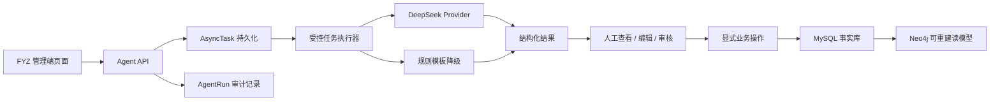

# FYZ 管理端 Agent 开发、修复与优化规划

> 文档类型：专项实施记录
> 状态：核心 MVP 已实现，统计为历史采样
> 2026-08-12 复核：独立 Agent 包 12 项测试通过，FYZ 后端拆分执行 311 项通过；本文中
> 更早的测试计数仅代表当时提交，不是当前总数。现状见
> [当前实现状态](../../docs/implementation-status.md)。

> 文档状态：实施中（核心 MVP 已完成）
> 编制日期：2026-07-25
> 适用范围：`fyz-src` 管理端及其直接关联的 `agent-development` Agent 运行时
> 主要负责人范围：FYZ 管理端 Agent、Agent 直接关联的前后端功能、审计与验收
> 关联文档：[FULLSTACK_PLAN.md](./FULLSTACK_PLAN.md)、[GRAPH_ARCHITECTURE.md](./GRAPH_ARCHITECTURE.md)

## 1. 文档目标

本文档作为后续 FYZ 管理端 Agent 开发的实施指南，目标不是重新设计全部业务，而是在当前可运行基础上：

1. 修复实测暴露的正确性、审计和权限问题；
2. 补齐已经存在于后端、但尚未形成管理端页面闭环的 Agent 功能；
3. 为技能抽取和图谱 L4/L5 补全建立可审核、可追踪、可回滚的管理流程；
4. 提升异步 Agent 任务的可靠性、可恢复性、可观测性和用户体验；
5. 建立接口测试、集成测试和 Playwright 实际页面测试共同组成的验收门禁。

本文档确认以下稳定边界：

- Agent 生成的是**可编辑草稿或建议**，不能自动发布公开岗位、开放内部岗位或直接作出转岗决定；
- 人工已编辑的内容不得被后到达的 Agent 结果静默覆盖；
- Agent 输出必须关联输入摘要、模型、Prompt 版本、证据、运行状态和操作者；
- MySQL 是业务事实与审计记录的来源，Neo4j 是可重建的图谱读模型；
- DeepSeek 不可用时允许返回明确标识的规则模板，但不能伪装成模型成功结果；
- 本规划不引入 Redis；如果未来需要多实例分布式任务队列，应单独评审基础设施方案。

## 2. 当前基线与已验证能力

### 2.1 自动化验证基线

2026-07-25 在当前代码上完成以下验证：

| 验证项 | 结果 |
| --- | --- |
| FYZ 后端全量测试 | `129 passed` |
| Agent 独立包测试 | `11 passed` |
| Agent 相关后端专项测试 | `18 passed` |
| FYZ 前端 Vitest | `21 passed` |
| FYZ 前端生产构建 | 通过 |
| Playwright 登录与真实页面联调 | 通过 |
| 浏览器控制台 | `0 error`、`0 warning` |

自动化测试通过只代表已有断言成立，不代表下文列出的功能闭环已经完成。

### 2.2 Playwright 实际页面验证

使用真实 MySQL、Neo4j、FastAPI、Vite 和 DeepSeek 完成：

- 管理员登录；
- JD 标题触发输入建议；
- 人工新增技能后修改标题，新建议进入“追加 / 替换 / 忽略”审核区，未覆盖人工内容；
- 公开 JD 生成；
- 内部岗位说明生成；
- 匹配解释生成；
- Agent 运行记录和异步任务写入真实数据库。

本次没有点击“发布公开岗位”或“保存内部岗位”，因此没有为了测试新增业务岗位。

### 2.3 当前 Agent 能力矩阵

| 能力 | 后端 | FYZ 页面 | 当前结论 |
| --- | --- | --- | --- |
| JD 输入建议 | 已实现 | 已接入 | 可用 |
| 公开 JD 生成 | 已实现 | 已接入 | 可用 |
| 内部岗位说明生成 | 已实现 | 已接入 | 可用 |
| 匹配解释 | 已实现 | 已接入 | 可用 |
| Career Planning | API、任务、Provider 已实现 | 当前页面未调用 | 未形成用户闭环 |
| 技能抽取 Agent | 已接入岗位/数据处理服务 | 无事实审核入口 | 后端可用、管理闭环缺失 |
| 图谱 L4/L5 补全 | 已接入图谱同步 | 无候选审核入口 | 后端可用、管理闭环缺失 |
| Agent 运行审计 | 支持按 ID 查询 | 无运行中心 | 运维闭环缺失 |

### 2.4 FYZ 真实接口与 Mock 边界

当前开发环境使用 `VITE_DATA_PROVIDER=hybrid`：

- 真实接口：岗位、人才、简历、匹配、内部转岗、图谱、趋势、Agent；
- Mock 数据：Dashboard、收藏、历史、Admin 等未被 `hybridDataProvider` 覆盖的模块；
- 后端 `changes` 和 `admin` 仍是占位路由。

Agent 开发不得把 Mock 页面展示当作真实后端完成证据。涉及 Dashboard、Admin 的内容应标为跨成员依赖。

## 3. 问题清单与优先级

### 3.1 P0：阻塞正确性或安全验收

| ID | 问题 | 实测或源码证据 | 影响 |
| --- | --- | --- | --- |
| P0-01 | Agent 审计时间时区混用 | 实测出现 `18:00 created_at`、`10:00 finished_at`；创建时间来自 MySQL `func.now()`，结束时间使用 `datetime.utcnow()` | 时间倒序，审计和耗时分析不可信 |
| P0-02 | Agent 接口缺少角色授权 | JWT principal 只有 `user_id/username`，Agent 路由仅校验登录 | 普通用户可能调用管理端生成、图谱同步等能力 |
| P0-03 | Agent 状态枚举不统一 | 大部分使用 `succeeded/degraded/failed`，技能抽取写入 `success` | 统计、筛选、恢复和前端展示容易出错 |
| P0-04 | Career Planning 无页面入口 | 后端 `/agents/career-plannings` 和前端 Provider/Store 已存在，当前转岗页面只调用规则匹配 | 已开发能力无法由用户使用 |

### 3.2 P1：缺少管理闭环或可靠性

| ID | 问题 | 影响 |
| --- | --- | --- |
| P1-01 | 缺少 Agent 运行中心 | 无运行列表、筛选、详情、失败重试、取消和输入输出审计页面 |
| P1-02 | 进程内任务缺少多进程互斥 | 多个 Uvicorn worker 可能重复恢复或执行同一任务 |
| P1-03 | 前端刷新后不能恢复任务和草稿 | 用户离开页面或刷新后，只能等待后台完成，不能继续原流程 |
| P1-04 | 技能事实缺少人工审核 | LLM 新增技能事实保持 `unverified`，但没有审核 API 和 UI |
| P1-05 | 图谱候选缺少人工审核 | 程序过滤后直接标记 `verified`，没有管理员批准、拒绝、证据查看和回滚 |
| P1-06 | 发布前一致性只提示不阻断 | 实测 Python 岗位混入大量 Java 技能时虽有模型警告，仍可直接发布 |
| P1-07 | Agent 成本字段未形成闭环 | `prompt_tokens/completion_tokens` 等字段未稳定写入和展示 |

### 3.3 P2：体验、性能和维护性

| ID | 问题 | 影响 |
| --- | --- | --- |
| P2-01 | 固定两秒轮询、最多 90 次 | 不区分前后台状态，产生额外请求，长任务体验一般 |
| P2-02 | Agent 错误展示不一致 | JD 生成只显示通用失败，建议接口能显示具体错误 |
| P2-03 | 两套 L4/L5 实现并存 | `agent-development/l45_agent` 与实际运行的 `src/jiebang_agents/graph_enrichment` 存在漂移风险 |
| P2-04 | 大型前端 Chunk | GraphView 和主包构建产生大包警告 |
| P2-05 | 部分图标操作缺少明确无障碍名称 | 自动化定位和键盘/读屏使用不稳定 |

## 4. 目标架构与统一契约

### 4.1 Agent 运行链



Agent 结果和业务提交必须分离。`RESULT` 完成不等于 `BUSINESS` 已执行。

### 4.2 统一状态

#### AsyncTask

```text
queued -> running -> succeeded
                  -> failed
                  -> cancelled
```

#### AgentRun

```text
queued -> running -> succeeded
                  -> degraded
                  -> failed
                  -> cancelled
```

约束：

- `success` 统一迁移为 `succeeded`；
- `degraded` 表示任务技术上完成，但输出来自模板或存在明确降级；
- `AsyncTask=succeeded` 可以对应 `AgentRun=degraded`，但响应中必须显示降级原因；
- 取消必须是协作式取消，不能留下永久 `running`；
- 失败重试创建新的 `AgentRun`，通过 `parent_run_id` 关联原运行，不能覆盖历史记录。

### 4.3 时间规范

- 所有数据库时间按 UTC 存储；
- Python 使用 timezone-aware UTC，不再新增 `datetime.utcnow()`；
- API 使用 ISO 8601，明确带 `Z` 或 `+00:00`；
- 前端根据浏览器时区展示；
- `created_at <= started_at <= finished_at`；
- 迁移旧数据前先统计历史时间分布，禁止直接假设所有历史时间都属于同一时区。

### 4.4 权限矩阵

| 操作 | 普通用户 | 招聘负责人 | 管理员 |
| --- | --- | --- | --- |
| 查看本人匹配解释 | 允许 | 允许 | 允许 |
| 创建本人匹配解释 | 允许 | 允许 | 允许 |
| JD 建议与 JD 生成 | 禁止 | 允许 | 允许 |
| 查看本人 AgentRun | 允许 | 允许 | 允许 |
| 查看全部 AgentRun | 禁止 | 仅管理范围 | 允许 |
| 重试/取消 Agent 任务 | 仅本人可取消允许项 | 允许管理范围 | 允许 |
| Career Planning | 按产品角色授权 | 允许 | 允许 |
| 技能事实审核 | 禁止 | 可配置 | 允许 |
| 图谱候选审核和同步 | 禁止 | 禁止 | 允许 |

角色来源必须进入 JWT 或每次查询数据库；不能只依赖前端隐藏按钮。

### 4.5 幂等与恢复

- 创建任务支持 `Idempotency-Key`；
- 同一用户、同一业务输入、同一幂等键只能创建一个有效任务；
- 任务执行前使用数据库原子更新或租约抢占；
- 记录 `worker_id/lease_until/attempt_no`；
- 服务启动只恢复租约已过期的 `queued/running` 任务；
- 同一任务不能在两个 API 进程同时执行；
- 页面在 `sessionStorage` 或 Pinia 持久化层保存当前 `task_id/agent_run_id`，刷新后继续查询；
- 恢复页面时不得重新提交相同任务。

## 5. 分阶段实施计划

### Phase 0：冻结基线与契约

#### 目标

在修改业务代码前固定状态、时间、权限、接口和验收边界。

#### 任务

1. 建立统一枚举：
   - `AgentRunStatus`；
   - `AsyncTaskStatus`；
   - `AgentType`；
   - `GenerationMode`。
2. 统计数据库中现有状态值和时间分布。
3. 明确当前单进程部署约束，并禁止在任务互斥完成前使用多 worker。
4. 为本文档中的 API 变更建立 Schema 草案。
5. 为每个 Phase 建立独立分支或小步提交，不混入 Admin、Dashboard 等无关功能。

#### 验收

- 状态枚举和时间策略完成评审；
- 有旧数据迁移与回滚方案；
- 相关接口 Schema 有请求/响应示例；
- 未修改业务行为。

### Phase 1：审计时间、状态和权限修复

#### 目标

先让 Agent 审计数据可信，并阻止越权调用。

#### 后端任务

1. 新增 Alembic 迁移：
   - 统一合法状态；
   - 评估增加 `started_at`；
   - 根据统计结果修复可明确判断的历史时区数据；
   - 无法可靠判断的数据保留并输出迁移报告，不盲目重写。
2. 将服务层 `datetime.utcnow()` 改为统一 UTC 工具。
3. 将技能抽取的 `success` 改为 `succeeded`。
4. 增加角色模型或权限依赖：
   - `require_recruiter`；
   - `require_admin`；
   - 资源归属检查。
5. 为 JD、Career、匹配解释、图谱同步和 AgentRun 查询分别应用权限。
6. 日志中增加 `task_id/agent_run_id/user_id/agent_type`，不记录 Prompt 全文和敏感简历正文。

#### 前端任务

1. 根据登录用户角色显示或隐藏功能；
2. 对后端 `403` 显示明确提示；
3. 时间展示统一转换为本地时间；
4. 对 `degraded` 使用独立标签和说明。

#### 测试

- 单元测试：所有合法/非法状态；
- API 测试：未登录、普通用户、招聘负责人、管理员；
- 数据库测试：时间单调性；
- 回归测试：当前 JD 和匹配解释功能不变；
- Playwright：普通用户看不到管理端 Agent 操作，管理员可正常使用。

#### 验收

- 新建 Agent 记录不再出现结束时间早于创建时间；
- 状态字段中不再产生 `success`；
- 越权调用返回 `403`；
- 旧测试和新增测试全部通过。

### Phase 2：Agent 运行中心与可靠任务执行

#### 目标

提供可观测、可恢复、可取消、可重试的管理闭环。

#### 建议 API

```text
GET  /api/v1/agents/runs
GET  /api/v1/agents/runs/{run_id}
POST /api/v1/agents/runs/{run_id}/retry
POST /api/v1/tasks/{task_id}/cancel
GET  /api/v1/tasks/{task_id}
```

`GET /agents/runs` 至少支持：

- `agent_type`；
- `status`；
- `created_by`；
- `created_from/created_to`；
- `page/page_size`；
- `sort=-created_at`。

#### 后端任务

1. 增加 AgentRun 分页列表；
2. 增加安全的输入摘要、结构化输出和错误详情；
3. 实现失败重试，保留父子运行关系；
4. 实现协作式取消；
5. 增加数据库租约，避免多进程重复执行；
6. 写入模型耗时、token 和可选成本估算；
7. 对长期 `running` 任务提供超时收敛；
8. 为重复任务提供幂等保护。

#### 前端任务

新增“Agent 运行中心”页面：

- 状态统计；
- 运行列表和筛选；
- 运行详情抽屉；
- Prompt 版本、模型、耗时、降级和错误显示；
- 取消、重试操作；
- 结构化输出预览；
- 跳回来源业务页面；
- 默认隐藏或脱敏简历、联系方式等敏感数据。

#### 测试

- 重复派发测试；
- 两个执行器竞争同一任务；
- 服务重启恢复；
- 取消 running 任务；
- 失败任务重试；
- 幂等键重复提交；
- 用户只能查看授权范围内的记录；
- Playwright：列表筛选、详情、取消、重试和刷新恢复。

#### 验收

- 单任务最多由一个执行器持有有效租约；
- 重启后任务能恢复或明确失败；
- 所有状态都能在页面解释；
- 不需要查数据库即可定位常见 Agent 故障。

### Phase 3：Career Planning 页面闭环

#### 目标

让已经实现的 Career Planning Agent 在 FYZ 管理端形成可用流程，同时保留确定性内部转岗匹配。

#### 产品边界

Career Planning Agent 与内部转岗规则匹配不能混为一个结论：

- 规则匹配：基于硬性规则和确定性评分；
- Agent 建议：基于已提供资料生成可解释建议；
- 管理层决定：必须由人工确认。

#### 页面方案

在“转岗分析与决策”中增加独立 Tab 或明确入口：

1. 选择企业人才或上传/提取简历；
2. 选择内部开放岗位；
3. 填写已有技能、企业技术栈和补充信息；
4. 创建 Career Planning 任务；
5. 展示当前匹配、目标匹配、技能缺口、学习阶段、项目建议；
6. 明确显示模型结果或模板降级；
7. 允许保存为分析记录，但不能直接确认转岗。

#### 后端任务

1. 复核 `CareerAnalysisRequest/Response` 与当前内部岗位 DTO；
2. 避免前端上传文本与数据库已存简历重复拼接；
3. 为输出增加证据引用或来源标识；
4. 保证内部岗位范围和用户权限；
5. 支持按 `task_id` 恢复分析结果。

#### 前端任务

1. 清理当前未使用的 Career Store 与 Provider 调用；
2. 接入现有 `/agents/career-plannings`；
3. 增加任务进度、降级提示、恢复和失败重试；
4. 将 Agent 建议和规则匹配结果分栏展示；
5. 提供“转为待确认决策”操作，仍需管理层确认。

#### 验收

- 用户可从实际页面完成一次 Career Planning；
- 页面清楚区分规则结果、模型建议和人工决定；
- 刷新页面后可恢复任务和结果；
- 模型不可用时显示模板降级，不伪装为模型建议；
- Playwright 覆盖成功、降级、失败和刷新恢复。

### Phase 4：技能事实与图谱候选审核

#### 目标

将 Agent 产生的技能事实和 L4/L5 候选从“后台自动处理”升级为可审计的人机协作流程。

#### 建议 API

```text
GET  /api/v1/skills/facts/review-queue
PUT  /api/v1/skills/facts/{fact_id}/review

GET  /api/v1/graph/enrichment-candidates
GET  /api/v1/graph/enrichment-candidates/{candidate_id}
PUT  /api/v1/graph/enrichment-candidates/{candidate_id}/review
POST /api/v1/graph/enrichment-candidates/{candidate_id}/rebuild
```

#### 审核状态

```text
unverified -> approved
           -> rejected
           -> needs_revision
```

图谱是否写入 Neo4j 应根据 `approved` 状态，而不是仅根据模型置信度直接视为人工验证。

#### 后端任务

1. 技能事实审核：
   - 展示原文证据；
   - 展示规则/LLM 抽取方法；
   - 支持修改规范技能映射；
   - 记录审核人、时间和备注。
2. 图谱候选审核：
   - 展示多个独立来源；
   - 展示技术点、知识点、置信度和过滤原因；
   - 审批后进入 Neo4j；
   - 拒绝后保留审计，不进入图谱；
   - 支持按快照回滚或重建。
3. 禁止把 `verified` 同时表示“程序过滤通过”和“人工审核通过”。

#### 前端任务

1. 在技能或 Admin 管理区增加事实审核队列；
2. 在 GraphView 或 Admin 中增加 L4/L5 候选审核；
3. 支持证据展开、来源跳转、批量审核和风险提示；
4. 对低置信度、单一来源和证据冲突进行突出显示。

#### 验收

- 每个进入图谱的 L4/L5 节点可追溯到候选、证据、AgentRun 和审核人；
- 未审核或已拒绝候选不能进入生产图谱；
- 重复同步保持幂等；
- Playwright 覆盖批准、拒绝、证据查看和权限限制。

### Phase 5：JD Agent 质量与任务恢复

#### 目标

在保持现有可编辑体验的基础上，降低技能串线、内容丢失和误发布风险。

#### 任务

1. 按 `target + mode + title + level + department` 保存输入状态；
2. 公开需求与内部需求分别维护建议和人工编辑状态；
3. 页面刷新后恢复 `task_id/agent_run_id` 和生成草稿；
4. 生成前执行确定性一致性检查：
   - 标题和核心技能是否明显冲突；
   - 内部岗位必填管理信息；
   - 公开岗位是否缺少关键发布字段；
   - required/trainable 技能是否重叠。
5. 警告分级：
   - `info`：可直接继续；
   - `warning`：需确认后继续；
   - `blocking`：必须修改或显式审批。
6. 发布动作增加二次确认，并明确显示当前是模型草稿还是模板草稿；
7. 保持人工输入保护：
   - 后到达建议进入 pending；
   - 用户选择追加、替换或忽略；
   - 不自动发布。

#### 测试

- 快速连续修改标题，旧响应不能覆盖新输入；
- 修改技能后重新建议；
- 公开/内部切换不串用草稿；
- Python 标题混入 Java 技能；
- 模型超时、格式错误和未配置 Key；
- 页面刷新后恢复；
- 发布前阻断和人工确认。

#### 验收

- 任何后到达响应都不能覆盖用户已编辑内容；
- 高风险冲突不能无确认发布；
- 刷新或短暂断网不会丢失已完成草稿；
- 降级结果始终有明显标识。

### Phase 6：可观测性、性能与代码收敛

#### 目标

降低长期维护成本，并提供可量化的 Agent 运行质量。

#### 任务

1. 指标：
   - 各 Agent 成功率、降级率、失败率；
   - P50/P95 耗时；
   - token 和估算成本；
   - 超时、重试、取消数量；
   - 人工采纳、修改、拒绝比例。
2. 日志：
   - 使用结构化日志；
   - 统一 request/task/run correlation ID；
   - 隐私字段脱敏。
3. 前端：
   - 页面不可见时降低轮询频率；
   - 完成或失败后立即停止轮询；
   - 评估 SSE，但不作为本阶段强制要求；
   - 拆分 GraphView、ECharts、G6 等大型依赖。
4. 代码收敛：
   - 明确 `src/jiebang_agents/graph_enrichment` 为唯一运行实现；
   - 将旧 `l45_agent` 标为迁移工具、合并或删除；
   - 更新 README、API 合同和架构文档；
   - 删除未使用的 Career Store/Mock 路径，或完成其正式接入。

#### 验收

- 可从指标定位某个 Agent 的失败和降级趋势；
- 日志不泄露简历正文、Token 或 API Key；
- 生产构建的大包问题有明确拆包结果或经评审接受；
- Agent 只有一个权威运行实现。

## 6. 跨成员依赖

以下内容不是 FYZ Agent 负责人单独完成的范围，但会影响最终验收：

| 依赖 | 责任边界 | Agent 侧需要 |
| --- | --- | --- |
| 用户角色与组织权限 | Auth/用户管理负责人 | 提供权限依赖和角色读取接口 |
| Admin 真实后端 | Admin 模块负责人 | 为 Agent 运行中心提供菜单或容器 |
| Dashboard 真实聚合 | Dashboard 负责人 | 可选接入 Agent 状态摘要，不由 Agent 侧重做 Dashboard |
| changes 真实接口 | 岗位变化负责人 | 为 JD 更新建议提供真实变化数据 |
| Neo4j 同步和回滚 | 图谱负责人 | 定义候选批准后写入及回滚边界 |
| 内部岗位与转岗规则 | 内转负责人 | 提供稳定 DTO 和规则匹配结果 |

依赖未完成时，Agent 侧应使用明确的接口桩或受控测试数据，不得宣称对应页面已完成真实联调。

## 7. 测试与验收策略

### 7.1 测试分层

| 层级 | 重点 |
| --- | --- |
| Agent 单元测试 | Prompt 输入、结构化输出、清洗、证据过滤、模板降级 |
| Service 测试 | 状态迁移、事务、权限、幂等、审计、时间 |
| API 测试 | 认证、角色、归属、错误码、分页、重试、取消 |
| 集成测试 | MySQL、DeepSeek、Neo4j、服务重启和任务恢复 |
| 前端 Vitest | Provider、Store、状态恢复、人工编辑保护 |
| Playwright | 真实页面、真实后端、真实数据库和可见结果 |

### 7.2 每个 Agent 的必测场景

1. 模型成功；
2. 模型未配置；
3. 模型超时；
4. 模型返回非法结构；
5. 模板降级；
6. 任务取消；
7. 失败重试；
8. 页面刷新恢复；
9. 越权访问；
10. 人工编辑后响应晚到；
11. 审计记录时间、状态和 Prompt 版本正确；
12. 敏感信息不进入日志。

### 7.3 Playwright 最小回归集

```text
登录
  -> 岗位管理
    -> 自动建议
    -> 人工编辑保护
    -> 公开 JD
    -> 内部岗位说明
    -> 刷新恢复
  -> 人才匹配
    -> 生成匹配解释
    -> 重新生成
  -> 转岗分析
    -> Career Planning
    -> 区分规则与 Agent 结果
  -> Agent 运行中心
    -> 筛选
    -> 详情
    -> 取消/重试
  -> 图谱候选审核
    -> 查看证据
    -> 批准/拒绝
```

每次页面测试必须同时检查：

- 页面可见状态；
- 浏览器控制台错误；
- 关键网络请求与响应；
- 数据库审计记录；
- 页面刷新后的恢复；
- 测试产生的业务数据是否需要回收。

### 7.4 Windows 验证命令

```powershell
# Agent 独立包
Set-Location E:\Project\JieBang\agent-development
& E:\Computer_tools\Anaconda\dld\envs\jiebang\python.exe -m pytest tests -q

# FYZ 后端全量
Set-Location E:\Project\JieBang\fyz-src\backend
& E:\Computer_tools\Anaconda\dld\envs\jiebang\python.exe -m pytest test -q

# FYZ 前端
Set-Location E:\Project\JieBang\fyz-src\frontend
npm.cmd run test
npm.cmd run build
```

Playwright 必须在 FastAPI 和 Vite 实际启动后执行，不能只依赖 Mock Provider 或 API 单测。

## 8. 数据迁移与回滚原则

1. 每个 Schema 变化必须使用 Alembic；
2. 迁移前输出受影响行数和状态/时间分布；
3. 时间修复分为：
   - 可确定时区：转换；
   - 不可确定时区：保留原值并记录异常；
4. 状态迁移建立旧值到新值的显式映射；
5. 新接口先兼容旧字段，再在确认无调用方后删除；
6. 图谱候选审批上线前，不删除旧候选和 AgentRun；
7. Neo4j 变更只操作 `namespace=jiebang`；
8. 回滚不能删除审计记录；
9. 测试和迁移不得覆盖用户已编辑的 JD 草稿或已有实验记录。

## 9. 开发纪律与 Definition of Done

### 9.1 开发前

- 明确本次任务属于哪个问题 ID 和 Phase；
- 写清输入、输出、权限、状态、失败和降级行为；
- 确认是否需要迁移；
- 确认受影响的后端、前端、Agent 包和文档；
- 先提交可评审设计，再修改业务代码。

### 9.2 完成标准

一个任务只有满足以下条件才可标记完成：

1. 代码实现覆盖完整调用链；
2. 旧行为兼容或已完成迁移；
3. 单元/API/集成测试通过；
4. 前端测试和构建通过；
5. 涉及页面时完成 Playwright 实测；
6. 验证真实接口，不把 Mock 当作完成证据；
7. 错误、降级、空数据、无权限和刷新恢复均有处理；
8. 审计记录可追踪；
9. 文档和 API 示例同步；
10. 工作区未混入 `.env`、日志、缓存、截图、测试数据库或构建产物。

## 10. 推荐实施顺序

| 顺序 | 工作包 | 建议周期 | 依赖 |
| --- | --- | --- | --- |
| 1 | Phase 0 契约冻结 | 0.5–1 天 | 无 |
| 2 | Phase 1 时间、状态、权限 | 2–3 天 | Auth 角色方案 |
| 3 | Phase 2 Agent 运行中心与可靠任务 | 4–6 天 | Phase 1 |
| 4 | Phase 3 Career Planning 页面闭环 | 3–4 天 | 内转 DTO 稳定 |
| 5 | Phase 4 技能/图谱审核 | 5–7 天 | 图谱写入与回滚边界 |
| 6 | Phase 5 JD 质量与恢复 | 3–4 天 | Phase 2 |
| 7 | Phase 6 可观测性与收敛 | 3–5 天 | 前述阶段 |

周期为单人连续开发的粗略估算，用于排序而非承诺日期。每个工作包应拆成可独立测试、可独立回滚的小提交。

## 11. 首批建议任务

后续开发建议从以下 5 个小任务开始：

1. **P0-01：统一 UTC 时间并增加时间单调性测试**；
2. **P0-03：统一 AgentRun/AsyncTask 状态枚举并迁移 `success`**；
3. **P0-02：为 Agent 路由增加角色权限依赖**；
4. **P1-01：增加只读 AgentRun 列表 API 和最小运行中心页面**；
5. **P0-04：为当前转岗页面增加 Career Planning 独立入口设计稿**。

首批任务完成并通过评审后，再进入取消/重试、图谱审核和 JD 发布门禁，避免一次改动同时触碰过多业务面。

## 12. 2026-07-30 实施记录

### 12.1 已完成

| 事项 | 状态 | 实施结果 |
| --- | --- | --- |
| P0-01 UTC 时间 | 完成 | AgentRun/AsyncTask 使用 UTC；运行记录具备开始、结束时间和单调性测试 |
| P0-02 路由角色授权 | 完成 | recruiter/admin 可执行管理端 Agent；普通用户访问管理能力返回 403 |
| P0-03 状态统一 | 完成 | 统一六态枚举；迁移旧 `success` 为 `succeeded` |
| P0-04 Career Planning 页面闭环 | 完成 | 在现有 `/career` 增加页签，接入真实异步接口、刷新恢复和人工决策边界提示 |
| P1-01 最小运行中心 | MVP 完成 | 在现有 `/admin`“日志与性能”增加 AgentRun 列表、筛选、分页和详情 |
| 请求幂等 | 完成 | JD 与 Career Planning 支持 `Idempotency-Key` 复用和冲突检测 |

### 12.2 验收证据

- 后端完整测试：144 passed。
- Agent 独立包测试：11 passed。
- FYZ 前端测试：28 passed；类型检查和生产构建通过。
- Playwright 真实执行 Career Planning 成功，刷新后恢复结果。
- 最新运行记录在管理端审计列表与详情中可见，开始/结束时间顺序正确。
- 浏览器控制台：0 error、0 warning。
- 数据库迁移：`20260730_0011`。

### 12.3 后续优化队列

1. P1-02：为多 Uvicorn worker 增加数据库租约或原子抢占，避免重复恢复与执行。
2. P1-01 完整版：增加失败任务重试、运行中任务取消以及相应权限和审计。
3. 技能/图谱候选审批：保持 MySQL 为事实源，Neo4j 只接收已审批的可重建读模型数据。
4. JD 发布门禁：Agent 只生成可编辑草稿，发布前必须完成人工确认与质量检查。
5. 可观测性：补充 Token 用量、费用、错误分类、耗时分位数和告警阈值。

以上项目按风险和真实使用反馈逐项实施，不在核心 MVP 中一次性扩展。
