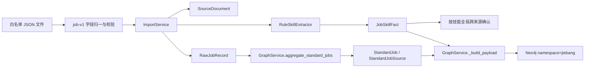
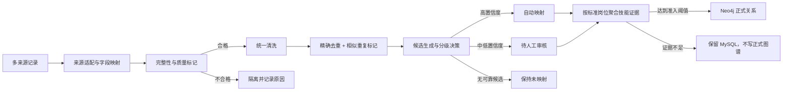

# FYZ 管理端优化任务一：数据链路、技能图谱与简历上传联合优化方案

> 文档状态：待评审，尚未修改业务代码
> 编制日期：2026-07-30
> 适用范围：`fyz-src/backend`、`fyz-src/frontend` 及其直接使用的 MySQL / Neo4j 数据链路
> 原始需求：[`docs/dev-prompt-tmp/FYZ管理端优化任务一.md`](../../docs/dev-prompt-tmp/FYZ管理端优化任务一.md)
> 设计原则：根因优先、最小范围修改、旧接口兼容、MySQL 事实源、Neo4j 可重建读模型

## 1. 结论先行

本次优化不应拆成三个互不相关的页面修补。当前问题来自同一条链路的三个层次：

1. **数据层**：导入校验已有基础，但岗位标准化始终返回固定高置信度，技能事实又按“全局技能跨来源次数”自动确认，导致低可信岗位映射和岗位—技能关系可能被过度提升。
2. **图谱层**：后端已有 `panorama / expand / search / path / job_tree`，但首屏默认上限为 1000；前端筛选值没有进入实际构图请求，并对孤立岗位逐个并发扩展，随后每次筛选又销毁并重建 ECharts 实例。
3. **交互层**：简历上传仍是同步请求内完成“保存、解析、技能抽取、全岗位匹配”，前端只维护 `uploading: boolean`，无法真实表达上传、解析和匹配的阶段，也无法覆盖需求中的 8 个完整状态。

推荐采用四个可独立验收的工作包：

| 工作包 | 目标 | 是否需要数据库迁移 | 是否调整接口 |
| --- | --- | --- | --- |
| A. 数据质量与标准化 | 原始数据可追溯、低置信度不强制映射、关系按岗位证据聚合 | 是，建议一条 Alembic 迁移 | 兼容性扩展 |
| B. 图谱查询与状态链路 | 首屏小数据、筛选真实生效、支持局部展开 | Neo4j 索引变更；MySQL 无强制迁移 | 兼容性扩展 |
| C. 图谱渲染与交互 | 复用实例、增量更新、降低重叠、保留视图状态 | 否 | 前端内部契约调整 |
| D. 简历上传体验 | 居中对称、8 状态完整、上传与后台处理可恢复 | 可复用现有 `Resume.status` 与 `AsyncTask`，首版可不迁移 | 新增异步入口，保留旧入口 |

在本方案通过评审前，不进入业务代码修改。

## 2. 当前实现与问题根因

### 2.1 岗位数据处理链路

当前真实链路为：



#### 已有可复用能力

- `job_import_schema.py` 已统一 `responsibilities / requirements / posted_at` 的旧字段别名，并校验核心字段。
- `SourceDocument.content_fingerprint` 与唯一约束可阻止完全相同记录重复入库。
- `RawJobRecord` 同时保留采集字段和 `normalized_data` 扩展位。
- `JobSkillFact` 已有置信度、证据文本、抽取方式、来源数量和人工审核字段。
- `StandardJob / StandardJobSource` 已形成 MySQL 审计边界。
- 图谱构建只读取 `verification_status == "verified"` 的技能事实。
- L4/L5 候选已有 0.75 置信度、至少两个独立来源及审核状态字段，但当前仍缺少完整人工审核闭环。

#### 主要根因

| ID | 根因 | 直接影响 |
| --- | --- | --- |
| D-01 | `ImportService` 与 `job_standardizer.py` 各有一套标题清洗逻辑 | 导入时的 `standardized_title` 和图谱同步时的标准化结果可能不一致 |
| D-02 | `standardize_job_title()` 无论输入质量、匹配方式和歧义都返回 `0.95` | 无法区分精确别名、规则推断、模糊候选和未知岗位 |
| D-03 | 标准化直接按清洗后的 `canonical_key` 新建标准岗位 | 低置信度输入仍会被强制落到某个正式标准岗位，没有待审核态 |
| D-04 | `StandardJobSource` 只记录原始标题和一个置信度 | 缺少清洗标题、匹配方法、候选、审核状态和解释，无法回答“为什么这样映射” |
| D-05 | 导入文件中任一记录失败会使整个文件失败 | 能挡住脏数据，但无法隔离坏记录并继续处理同批合格数据 |
| D-06 | `normalize_text()` 主要压缩空白，没有统一清理 HTML、零宽字符和无意义片段 | 噪声会进入指纹、岗位字段、技能证据和图谱标签 |
| D-07 | 内容指纹包含 URL 等完整字段，只能识别完全相同记录 | 同岗位换 URL、轻微改文案或跨平台重复时不会被标记为近似重复 |
| D-08 | `_cross_validate_facts()` 按 `skill_id` 统计全局独立来源 | 某技能在两个平台出现后，该技能在单个岗位上的弱证据也可能被自动标为 verified |
| D-09 | 图谱边虽已写入 frequency/sourceCount/confidence，但未按“标准岗位 + 技能”建立清晰准入阈值 | 岗位—技能关系的强弱仍可能被全局技能热度放大 |
| D-10 | 现有质量卡片主要覆盖字段完整性、去重率和技能事实状态 | 缺少标准化成功率、待审核数、关系置信度、孤立率和异常关系率 |

### 2.2 技能知识图谱

当前前端链路实际为：


#### 已有可复用能力

- 后端已有参数化 Neo4j 查询并限制 `namespace=jiebang`。
- `/graph/panorama` 已支持 `stack`、`level`、`node_type`、`keyword`、`limit`。
- `/graph/expand`、`/graph/search`、`/graph/path`、`/graph/jobs/{id}/tree` 已存在。
- ECharts 已开启 `roam` 与 `draggable`，具备平移、缩放和拖拽基础。
- 前端已有 `useGraphStore` 和 `dataProvider.graph`，只是当前 `GraphView` 没有使用。

#### 主要根因

| ID | 根因 | 直接影响 |
| --- | --- | --- |
| G-01 | `GraphView.loadGraph()` 不传入 `keyword / selectedStack / selectedLevel / selectedType` | 控件变化只触发同一请求，层级和筛选看似切换、实际数据不变 |
| G-02 | `buildGraphFromBackend()` 固定 `getPanorama({ limit: 1000 })` | 首屏请求接近全量，违反渐进式加载目标 |
| G-03 | 构图函数同时负责请求、N 次扩展、转换和布局 | 难以取消旧请求、缓存响应、测试筛选参数或做增量合并 |
| G-04 | 对所有孤立 Job 执行 `Promise.all(expand)` | 形成突发多请求，存在典型 N+1 放大 |
| G-05 | 后端 `level` 表示岗位级别，左侧五层模型用 `node_type` 表示 | “岗位职级”和“图谱层级”命名混在一起，容易传错参数 |
| G-06 | `/panorama` 默认和最大上限均为 1000，边查询没有 `min_confidence` | 首屏数据密度过高，弱关系也进入渲染 |
| G-07 | ECharts 所有节点标签始终显示，力导向参数固定 | 节点增多后标签重叠、连线交叉和持续抖动 |
| G-08 | `props.graph` 或高亮路径变化时直接 `dispose()` 再 `init()` | 缩放、平移、拖拽位置和布局稳定状态全部丢失 |
| G-09 | 节点拖拽结果没有回写到图数据，点击更新又重新生成 option | 拖拽位置不能稳定保存，用户感知为“拖不住” |
| G-10 | 快速筛选只有 debounce，没有 AbortController 或请求序号守卫 | 慢的旧请求可能覆盖新的筛选结果 |
| G-11 | 点击节点当前只做高亮和详情，没有调用 `expand` | 后端已有局部展开能力，但用户界面没有形成闭环 |
| G-12 | 空图只会显示空画布，Canvas 内没有独立空状态 | 用户无法判断是无数据、筛选无结果还是接口失败 |

### 2.3 简历上传区域

当前实现为一个 `520px` 的 Element Plus 对话框：顶部文件按钮，下方五个表单字段，底部“取消 / 上传并匹配”。前端提交后调用 `POST /resumes`，后端在同一个请求中依次完成解析、去重、保存、技能抽取、匹配和提交事务。


#### 截图可见问题

1. 文件选择按钮靠左，未形成居中的主要上传落点。
2. 文件操作和补充资料同权展示，主任务不突出；用户首先看到的是一组近似“禁用态”的灰色输入框。
3. 文件行与姓名字段之间出现明显断层，纵向节奏不连续。
4. 没有支持格式、20MB 限制、拖拽提示、文件大小和解析说明。
5. 主按钮浅蓝且未解释禁用原因，容易被理解为不可用或视觉层级不足。
6. 成功、失败只通过全局 Toast 表达，弹窗内部没有可恢复的状态反馈。
7. 关闭弹窗、失败后重试和再次打开时，表单与文件状态没有统一复位策略。

截图只能支持视觉判断；键盘顺序、焦点圈、读屏名称、真实拖拽、上传进度和错误恢复仍需在实现后用浏览器验证。

#### 代码根因

| ID | 根因 | 直接影响 |
| --- | --- | --- |
| U-01 | 只有 `uploading: boolean` 和 `uploadFile: File \| null` | 无法表达需求中的 8 个状态 |
| U-02 | Provider 的 `upload()` 返回 `Promise<void>` | 前端拿不到解析警告、技能、匹配结果和任务 ID |
| U-03 | 单个同步接口承担保存、解析、抽取和全岗位匹配 | 无法区分“上传完成”和“正在解析”，长请求也不可恢复 |
| U-04 | 未配置 `onUploadProgress` | 即使浏览器已传输文件，也没有真实进度 |
| U-05 | 文件限制只放在 `accept`，前端没有选择前/选择后校验 | 不支持明确的格式、大小和空文件错误 |
| U-06 | 上传组件结构没有拖拽区、文件摘要和状态区域 | 仅修改 CSS 也无法补齐反馈 |
| U-07 | 五个补充字段默认全部展开 | 对首要任务形成视觉干扰，增加首次上传负担 |
| U-08 | 上传成功后直接关闭弹窗并刷新列表 | 用户看不到解析警告、匹配摘要，也无法确认刚处理的是哪个文件 |

## 3. 目标设计

### 3.1 数据链路目标



核心规则：

- 不再返回固定置信度。
- 不因“必须有标准岗位”而新建错误标准岗位。
- 人工审核结论优先于自动重算，重跑任务不得覆盖人工决定。
- 图谱准入按“标准岗位 + 技能 + 独立来源 + 证据”计算，不按技能全局热度替代岗位相关性。
- 原始数据、清洗数据、标准化结果、准入决定和图谱快照可串联追溯。

### 3.2 标准化决策模型

建议新增 `JobStandardizationResult` 领域对象，不直接把所有规则塞进 ORM：

```text
original_title
cleaned_title
standard_job_id | null
standard_job_name | null
match_method
confidence
needs_review
review_status
explanation
candidate_matches[]
```

建议阈值：

| 匹配路径 | 建议置信度 | 自动处理 |
| --- | --- | --- |
| 规范名精确命中 | 0.98 | 自动映射 |
| 已审核别名精确命中 | 0.95 | 自动映射 |
| 中英文/缩写字典精确命中 | 0.92 | 自动映射 |
| 规则归一后唯一候选 | 0.86–0.91 | 自动映射并保留解释 |
| 多候选或模糊相似 | 0.70–0.85 | 待审核 |
| 无可靠候选 | < 0.70 | 不映射 |

阈值必须通过实际标注样本评估后再冻结，不能只凭经验直接宣称“准确率提升”。

### 3.3 图谱查询目标

首屏不再等于全图。建议采用：

- 默认 `limit=120`，只返回活跃 `Job / SkillArea / TechStack` 核心节点和高置信关系。
- 五层按钮使用明确的 `layer=L1..L5`，岗位职级改用 `seniority=junior|middle|senior`。
- 兼容旧参数：旧 `level=junior|middle|senior` 在过渡期继续映射到 `seniority`。
- 选择中心节点时使用 `root_id + depth` 或现有 `/expand` 局部加载。
- 边支持 `min_confidence`，默认建议 `0.75`。
- 响应增加 `query`、`available_count` 和 `truncated_reason`，让前端能解释“当前只显示部分数据”。
- 首屏不再自动扩展每个孤立 Job；孤立节点由用户点击后按需展开。

### 3.4 图谱交互目标

界面保持当前管理端蓝白卡片风格，不引入夸张渐变或重动画。建议布局：

- 左侧：五层模型与当前层节点数量。
- 中间：图谱画布、搜索、适应画布、重置、重新布局、返回上一级。
- 右侧：节点详情、证据摘要、展开一层/两层、锁定/释放。
- 画布顶部持续显示“已加载 X / 可用 Y 个节点”，截断时有明确提示。

交互约束：

- 单击：选中并展示详情，不重建实例。
- 双击或详情按钮：展开一层。
- 拖拽节点：只更新该节点位置，并自动锁定。
- 拖拽空白：平移。
- 滚轮：缩放；标签按缩放级别显示。
- 返回上一级：恢复上一次子图和视口，不重新请求已缓存数据。
- 快速筛选：取消旧请求或用请求序号丢弃旧响应。
- 空数据、请求失败、加载中都在画布区域给出独立状态。

### 3.5 简历上传视觉与信息架构

推荐保留对话框入口，避免打断人才列表上下文，但将对话框改为 `min(720px, calc(100vw - 32px))`，内部主内容最大宽度 600px 并水平居中。

```text
┌──────────────────────────────────────────────────────┐
│ 上传简历并生成岗位匹配                         关闭 │
│ 上传 PDF、DOCX、TXT 或 Markdown，系统将提取技能并匹配 │
│                                                      │
│   ┌──────────────────────────────────────────────┐   │
│   │                 上传图标                     │   │
│   │          拖拽简历到这里，或选择文件          │   │
│   │             PDF / DOCX / TXT / MD            │   │
│   │                   最大 20MB                   │   │
│   └──────────────────────────────────────────────┘   │
│                                                      │
│   已选文件 / 进度 / 成功或错误反馈区域               │
│                                                      │
│   ▸ 补充候选人信息（可选）                           │
│                                                      │
│                         取消   开始解析并匹配         │
└──────────────────────────────────────────────────────┘
```

视觉规范：

- 使用现有 `--color-brand`、语义色、`--radius-lg`、`--shadow-sm` 和 Plus Jakarta Sans。
- 上传卡片使用边框与浅色背景建立层级，不新增强阴影、玻璃拟态或大面积渐变。
- 拖拽悬停仅改变边框、背景和图标颜色，动画控制在 150–200ms。
- 文件信息使用单行卡片：文件图标、名称、大小、状态、删除/重选。
- “补充候选人信息”默认折叠；展开后使用两列栅格，窄屏改单列。
- 主按钮文案随状态变化，不用同一个“上传并匹配”覆盖所有阶段。
- 对话框关闭后按明确策略复位；处理中关闭时提示任务可在后台继续，并允许再次打开恢复。

### 3.6 简历上传 8 状态机

| 状态 | 页面反馈 | 允许操作 |
| --- | --- | --- |
| `idle` 未选择 | 居中拖拽区、格式和 20MB 提示 | 选择文件、拖拽 |
| `dragover` 拖拽悬停 | 品牌色边框与“松开即可选择” | 放下文件、离开 |
| `selected` 已选择 | 文件名、大小、格式、校验结果 | 删除、重选、补充信息、开始 |
| `uploading` 正在上传 | 真实字节进度、禁用重复提交 | 取消本地请求 |
| `uploaded` 上传成功 | “文件已安全上传，准备解析” | 自动进入解析，不要求重复点击 |
| `upload_failed` 上传失败 | 卡片内错误原因 | 重试、删除、重选 |
| `parsing` 正在解析 | 阶段文本：解析文本 → 提取技能 → 计算匹配 | 可关闭，后台继续；再次打开恢复 |
| `completed` 解析完成 | 技能数、匹配岗位数、最高匹配摘要、警告 | 查看人才、继续上传、关闭 |

后端解析失败属于 `processing_failed`，视觉上复用失败卡片，但错误文案必须明确“上传已完成，解析失败”，不能混成网络上传失败。

## 4. 接口与兼容策略

### 4.1 数据导入

保留：

```text
POST /api/v1/data-imports/jobs
GET  /api/v1/tasks/{task_id}
```

兼容性扩展请求：

```json
{
  "files": ["jd_crawl_ifly.json", "jd_crawl_zl.json"],
  "allow_partial": true
}
```

- `allow_partial` 默认 `false`，保留现有“发现坏记录则整批失败”行为。
- 管理端新流程显式使用 `true`，合格记录继续入库，不合格记录进入任务结果中的 quarantine 报告。
- 任务结果增加 `quality_metrics`、`quarantined_records`、`standardization_summary`，旧字段保持不变。

建议新增只读接口：

```text
GET /api/v1/data-imports/quality
GET /api/v1/job-standardizations/reviews
PUT /api/v1/job-standardizations/reviews/{source_type}/{source_id}
```

### 4.2 图谱

保留现有 `/graph/panorama`，扩展参数：

```text
layer=L1|L2|L3|L4|L5
seniority=junior|middle|senior
root_id=job:123
depth=1..3
node_type=Job|SkillArea|TechStack|TechPoint|KnowledgePoint
keyword=...
limit=1..500
min_confidence=0..1
```

兼容规则：

- 旧 `level=junior|middle|senior` 继续生效并记录弃用提示。
- 若 `root_id` 存在，返回以该节点为中心的局部子图。
- 不删除现有 `/expand`，新页面仍可直接调用它。
- 响应保留原字段，只追加：

```json
{
  "available_count": 428,
  "query": {
    "layer": "L3",
    "limit": 120,
    "min_confidence": 0.75
  },
  "truncated_reason": "node_limit"
}
```

### 4.3 简历上传

保留现有同步入口：

```text
POST /api/v1/resumes
```

新增 FYZ 管理端异步入口：

```text
POST /api/v1/resume-imports
GET  /api/v1/tasks/{task_id}
```

`POST /resume-imports` 完成文件校验、去重、存储和任务创建后立即返回：

```json
{
  "resume_id": 123,
  "task_id": "uuid",
  "status": "queued",
  "filename": "candidate.pdf",
  "file_size": 328114
}
```

任务阶段建议写入 `AsyncTask.result.phase`：

```text
uploaded -> parsing -> extracting_skills -> matching -> completed
```

旧调用方继续使用 `/resumes`，新 `Matching.vue` 切换到异步入口。待异步流程稳定且调用方完成迁移后，再单独评审是否废弃同步入口。

## 5. 数据库与索引方案

### 5.1 建议 Alembic 迁移

建议新增 revision `20260730_0013_job_standardization_audit.py`：

`standard_job_source` 增加：

- `cleaned_title`；
- `match_method`；
- `needs_review`；
- `review_status`：`auto_accepted / pending / approved / rejected / unmapped`；
- `explanation`；
- `candidate_data` JSON；
- `reviewed_by / reviewed_at / review_note`。

并将 `standard_job_id` 调整为可空，使 `pending / unmapped` 记录不必伪造正式标准岗位。

迁移原则：

- 现有记录回填 `match_method=legacy_rule`、`review_status=auto_accepted`。
- 现有 `confidence` 保留，不重命名，避免影响读取方。
- 不自动重算历史标准化结果；通过显式回填任务生成新版结果。
- 回滚只撤销新增字段和约束，不删除既有 `StandardJob` 或图谱快照。

`RawJobRecord.normalized_data` 首版用于保存：

```json
{
  "schema": "job-v1",
  "source_file": "jd_crawl_ifly.json",
  "source_index": 12,
  "raw_record": {},
  "cleaned_record": {},
  "quality_flags": [],
  "dedup": {
    "exact": false,
    "similar_candidate_ids": []
  }
}
```

因此首版不强制给 `raw_job_record` 增加更多列。

### 5.2 Neo4j

- 保留 `(namespace, id)` 唯一约束。
- 为常用过滤属性增加可验证的索引：`namespace + stack`、`namespace + level`、节点类型常用排序字段。
- 搜索从 `toLower(name) CONTAINS` 迁移到 Neo4j 全文索引前，先用实际数据验证版本和查询计划。
- 所有新增或清理操作必须限制 `namespace=jiebang`。
- 边查询增加 `coalesce(r.confidence, 1.0) >= $min_confidence` 和最大关系数。

## 6. 计划修改文件

以下是设计阶段的预计清单，实施时以实际最小修改为准。

### 6.1 数据处理与标准化

| 文件 | 计划 |
| --- | --- |
| `backend/app/services/job_import_schema.py` | 增加来源标记、质量 flag、部分导入报告 |
| `backend/app/services/import_service.py` | 统一清洗、隔离坏记录、保存 raw/cleaned、调整关系校验 |
| `backend/app/services/skill_extractor.py` | 强化 HTML/特殊字符清洗与证据校验，不破坏现有规则 |
| `backend/app/domain/job_standardizer.py` | 返回结构化候选与真实置信度，不再固定 0.95 |
| `backend/app/domain/job_cleaner.py` | 新增统一文本和字段清洗领域函数 |
| `backend/app/services/graph_service.py` | 接入审核态标准化结果，按标准岗位聚合技能关系 |
| `backend/app/models/graph.py` | 扩展 `StandardJobSource` 审计字段 |
| `backend/app/schemas/graph.py` | 增加标准化和图谱查询扩展 DTO |
| `backend/app/api/v1/data_imports.py` | 增加 `allow_partial` 与质量结果 |
| `backend/app/api/v1/job_standardizations.py` | 新增待审核列表和审核 API |
| `backend/alembic/versions/20260730_0013_job_standardization_audit.py` | 数据库迁移 |
| 对应 `backend/test` 文件 | 单元、Service、API 与迁移测试 |

### 6.2 图谱查询与前端

| 文件 | 计划 |
| --- | --- |
| `backend/app/api/v1/graph.py` | 扩展 layer/seniority/root_id/min_confidence，降低默认 limit |
| `backend/app/repositories/graph_repository.py` | 边置信度过滤、计数、查询上限和索引 |
| `backend/app/services/graph_service.py` | 概览/局部查询、截断元数据、关系阈值 |
| `frontend/src/data/provider.ts` | 扩展 GraphQuery 和响应元数据 |
| `frontend/src/data/httpProvider.ts` | 映射新参数 |
| `frontend/src/stores/graph.ts` | 请求序号、子图缓存、增量合并、导航历史 |
| `frontend/src/data/graphBuilder.ts` | 改为纯转换函数，移除请求和 N+1 expand |
| `frontend/src/views/GraphView.vue` | 使用 Store，接通筛选、局部展开、空/错/加载状态 |
| `frontend/src/components/graph/Graph3DCanvas.vue` | 复用实例、增量 setOption、视口与拖拽位置保持 |
| 对应前后端测试 | 查询参数、竞态、合并、交互与性能测试 |

`SigmaCanvas.vue` 当前不是页面实际渲染路径，首版不同时重写；确认无调用方后再单独删除或归档，避免扩大范围。

### 6.3 简历上传

| 文件 | 计划 |
| --- | --- |
| `backend/app/api/v1/matching.py` | 新增异步简历导入入口，保留同步入口 |
| `backend/app/services/matching_service.py` | 拆分存储、解析、技能抽取、匹配步骤 |
| `backend/app/tasks/resume_import.py` | 新增可恢复后台任务 |
| `backend/app/schemas/matching.py` | 增加上传创建和处理结果 DTO |
| `frontend/src/domain/types.ts` | 增加上传状态、结果和错误类型 |
| `frontend/src/data/provider.ts` | `upload` 不再返回 void，新增进度/任务接口 |
| `frontend/src/data/httpProvider.ts` | FormData 进度与异步任务轮询 |
| `frontend/src/stores/talents.ts` | 上传任务状态、恢复、成功后增量刷新 |
| `frontend/src/components/matching/ResumeUploadDialog.vue` | 新增独立上传组件与 8 状态 |
| `frontend/src/views/Matching.vue` | 只负责打开组件和处理完成事件 |
| `frontend/src/assets/styles/global.css` | 仅增加复用 token 无法覆盖的少量状态样式 |
| 对应前后端测试 | 文件校验、任务状态、恢复、8 状态与可访问性 |

## 7. 分阶段实施与验证

### Phase 0：冻结样本与基线

1. 从现有数据抽取岗位标准化标注样本，覆盖中英文、缩写、等级、方向、噪声和模糊名称。
2. 固定当前导入结果、标准岗位数、技能事实数、图谱节点/边数。
3. 记录图谱接口 P50/P95、首屏节点/边数和浏览器渲染时间。
4. 记录简历上传成功、重复、空文件、超大、扫描 PDF 和无开放岗位场景。

验收：形成可重复运行的基线脚本和样本，未修改业务行为。

### Phase 1：数据清洗、标准化与关系准入

1. 统一清洗入口，删除重复标题标准化逻辑。
2. 增加结构化标准化结果、阈值与审核态。
3. 增加迁移并保留历史结果。
4. 将技能关系验证改为“标准岗位 + 技能”的独立来源和证据聚合。
5. 增加质量指标和待审核查询。

验收：

- 低于阈值的岗位不产生正式映射。
- 人工审核结果重跑后不被覆盖。
- 无证据技能和被否定语境技能不进入正式关系。
- 标准化准确率使用标注样本计算，不使用主观描述。

### Phase 2：图谱后端查询与筛选链路

1. 扩展兼容参数和响应元数据。
2. 首屏核心节点限制为 120，去掉前端孤立岗位 N+1 扩展。
3. 接通五层模型、岗位职级、方向、关键词和最低置信度。
4. 加入查询计时、Neo4j profile 验证和必要索引。

验收：

- 首屏不请求 1000 节点。
- 每个筛选控件都能在网络请求中看到对应参数。
- 不同 layer 返回集合存在明确差异。
- 快速连续点击时最终页面只呈现最后一次请求。

### Phase 3：图谱渲染与交互

1. Store 负责数据、缓存、请求竞态和导航历史。
2. 构图函数只做 DTO → Graphology 转换。
3. Canvas 只初始化一次，数据与高亮用增量更新。
4. 加入缩放级别标签、碰撞间距、布局停止条件和拖拽回写。
5. 完成局部展开、详情、搜索定位、重置、适应画布、返回上一级和锁定/释放。

验收：

- 筛选和点击详情不销毁 ECharts 实例。
- 拖拽节点不触发全图重建。
- 平移、缩放、重置、局部展开均可用。
- 300 节点受控场景下无持续抖动，标签密度可读。

### Phase 4：简历上传 8 状态

1. 先拆后端步骤并建立异步任务，不先写视觉 CSS。
2. 实现 Provider 进度与 Pinia 任务恢复。
3. 新建 `ResumeUploadDialog.vue`，按状态机渲染。
4. 接入 Matching 页面，完成成功后列表刷新和结果入口。
5. 完成桌面、常见笔记本和窄屏适配。

验收：

- 8 个状态均有组件测试和实际页面截图。
- 上传失败与解析失败文案可区分。
- 页面刷新或关闭重开后可恢复正在解析的任务。
- 同一文件重复上传继续受到服务端哈希约束。
- 成功后可直接打开新增人才，不依赖 Toast 猜测结果。

## 8. 测试与量化验收矩阵

| 层级 | 必测内容 |
| --- | --- |
| 后端单元测试 | 清洗、别名、中英文、缩写、等级、方向、模糊候选、否定技能 |
| Service 测试 | 部分导入、审核保护、岗位—技能证据聚合、任务阶段 |
| API 测试 | 新旧参数兼容、边置信度、分页/limit、错误码、权限、任务恢复 |
| Repository 测试 | 参数化 Cypher、namespace 隔离、边数上限、索引可用性 |
| 前端 Vitest | GraphQuery 映射、竞态守卫、子图合并、上传 8 状态 |
| 前端构建 | `npm.cmd run test`、`npm.cmd run build` |
| 浏览器实测 | 图谱筛选/拖拽/平移/缩放/展开；简历拖拽/进度/成功/失败/恢复 |
| 真实集成 | MySQL + Neo4j + FastAPI + Vite；不得用 Mock 结果替代 |

建议量化指标：

| 指标 | 基线 | 目标 |
| --- | --- | --- |
| 标准化准确率 | Phase 0 测量 | 在固定标注集上提升，且低置信度误映射为 0 |
| 待审核召回率 | Phase 0 测量 | 所有歧义样本进入 pending/unmapped |
| 岗位—技能关系精确率 | Phase 0 抽样 | 无证据与错误技能明显下降 |
| 图谱首屏节点数 | 最高 1000 + N 次扩展 | 默认不超过 120 |
| 图谱首屏 API P95 | Phase 0 测量 | 比基线降低至少 40%，再按真实环境确认 |
| 图谱实例重建次数 | 筛选/高亮变化均可能重建 | 页面生命周期内初始化 1 次 |
| 快速筛选竞态 | 无守卫 | 旧响应不得覆盖新响应 |
| 上传状态覆盖 | 约 3 类 | 8 个需求状态全部覆盖 |
| 上传任务恢复 | 不支持 | 刷新/重开可恢复 |

“明显提升”和“明显减少”必须用 Phase 0 固定样本给出具体前后数字，不能只凭肉眼验收。

## 9. 风险、回滚与非目标

### 9.1 风险

- 标准化阈值过严会增加待审核量；过松会继续误映射。
- 旧 `level` 参数语义与新图谱层级命名冲突，需要完整兼容测试。
- ECharts force 布局在不同节点规模下参数差异较大，必须用 50/120/300 节点三档验证。
- 异步简历处理会引入任务恢复、失败清理和文件生命周期管理。
- 扫描 PDF 仍可能只能给出“需 OCR”警告；OCR 不应在本任务中无评审扩张。
- 当前工作区存在与本任务无关的修改和未跟踪文件，实施时必须按文件精确暂存，不能使用 `git add -A`。

### 9.2 回滚

- MySQL 迁移先向前兼容，旧字段和旧接口保留一个发布周期。
- 图谱索引可独立删除；Neo4j 数据始终可从 MySQL 使用 `full` 模式重建。
- 新前端上传入口可切回旧 `/resumes`，已创建的 Resume 和 MatchRecord 不删除。
- 图谱前端保留旧转换逻辑到 Phase 3 验收通过，再移除 N+1 扩展代码。
- 所有人工审核记录和原始数据不因回滚删除。

### 9.3 本任务非目标

- 不重做整套管理端视觉设计。
- 不引入新的搜索引擎、向量数据库或 ChromaDB。
- 不把 Neo4j 提升为事实源。
- 不自动发布岗位、不自动作出人才录用或转岗决定。
- 不在没有标注集的情况下宣称模型或规则准确率达到某个绝对值。
- 不同时重写 `SigmaCanvas.vue` 与 `Graph3DCanvas.vue` 两套渲染器。

## 10. 评审门禁

进入业务代码前建议确认以下三项：

1. 同意扩展 `StandardJobSource`，允许 `standard_job_id` 为空并承载待审核/未映射结果。
2. 同意新增 `/resume-imports` 异步入口，同时保留现有 `/resumes` 兼容入口。
3. 同意图谱参数使用 `layer` 表示 L1–L5、`seniority` 表示岗位职级，并兼容旧 `level`。

评审通过后，严格按 Phase 0 → Phase 1 → Phase 2 → Phase 3 → Phase 4 顺序实施；每个 Phase 完成基础验证并提交结果后，再进入下一阶段。
